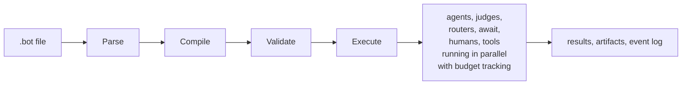
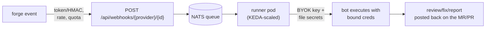

<p align="center">
  
</p>

# Iterion

**From dev to imperator — command a legion of bots at the next level.**
*Veni, vidi, merged.*

**Bots, as code.** *Declarative workflow orchestration for AI agents.*

Stop coding like a mortal. Define your bots as readable `.bot` files — chain agents, judges, routers, human gates, parallel branches, bounded loops, and budget caps into a single, auditable execution graph, then command from the next level.

> ⚠️ **This project is highly experimental.** APIs, DSL syntax, and storage formats may change without notice. Use at your own risk in production environments. Feedback and contributions are welcome!

> 📖 **New here? Read [Why Iterion?](docs/why-iterion.md)** — the origin story, the patterns we've seen work, the asymptote lens that motivated the engine, and the workflow-lab dimension. Helps you decide whether Iterion fits how you work before you install anything.

---

## Table of Contents

- [Why Iterion?](docs/why-iterion.md) — origin + recipe + asymptote + lab
- [What is Iterion?](#what-is-iterion)
- [Features](#features)
- [Meet the legion](#meet-the-legion)
- [Quick Start](#quick-start)
- [Workflow files](#workflow-files)
- [A Taste of the DSL](#a-taste-of-the-dsl)
- [Documentation](#documentation)
- [License](#license)

---

## 🧩 What is Iterion?

*If you've ever noticed yourself repeating the same prompt-and-review patterns while vibe-coding with an LLM — "ask the model, eyeball the diff, ask it to fix what it missed, run the tests, ask again" — and wondered how to **automate and optimize** that loop, Iterion is built for you.* Capture the pattern once as a `.bot` workflow, give it budget caps, parallel reviewers, judges and human gates, and let the engine run it deterministically every time.

Iterion is a workflow engine that turns `.bot` files into executable AI pipelines. You describe *what* your agents should do — review code, plan fixes, check compliance, ask a human — and Iterion handles *how*: scheduling branches in parallel, enforcing budgets, persisting state, and routing between nodes.



Think of it as a DAG runner purpose-built for LLM workflows — with first-class support for things like structured I/O, conversation sessions, human-in-the-loop pauses, and cost control.

<p align="center">
  
  <br/>
  <em>The studio's visual editor — drag-and-drop graph, live diagnostics, and an inspector for every node. See <a href="docs/visual-editor.md">more screenshots</a>.</em>
</p>

---

## 📋 Features

### Authoring & orchestration

- 📝 **Declarative DSL** — Human-readable `.bot` files with indentation-based syntax
- 🤖 **Multi-agent orchestration** — Chain agents, judges, routers, and await-based convergence into complex graphs
- 🖥️ **Visual editor** — Browser-based workflow builder with drag-and-drop, live validation, and source view
- 🙋 **Human-in-the-loop** — Pause for human input, auto-answer via LLM, or let the LLM decide when to ask
- 🔀 **Parallel branching** — Fan-out via routers, converge at downstream nodes with `await: wait_all` / `await: best_effort`
- 🧭 **4 routing modes** — `fan_out_all`, `condition`, `round_robin`, and `llm`-driven routing
- 🔁 **Bounded loops** — Retry and refinement cycles with configurable iteration limits
- 🔲 **Structured I/O** — Typed schemas for inputs and outputs with enum constraints
- 🔗 **MCP support** — Declare MCP servers directly in `.bot` files (`stdio`, `http`)
- 🧪 **Recipe system** — Bundle workflows with presets for comparison and benchmarking
- 📐 **Mermaid diagrams** — Auto-generate visual workflow diagrams (compact / detailed / full)

### Execution & runtime

- 🔌 **Delegation** — Offload execution to external agents (Claude Code, Codex) with full tool access — works with Claude and ChatGPT/Codex subscriptions
- 🌐 **Provider-agnostic** — In-process `claw` backend supports Anthropic and OpenAI (validated), plus Bedrock, Vertex, Foundry (via the vendored `claw-code-go` SDK)
- 💰 **Budget enforcement** — Shared, mutex-protected caps on tokens, cost (USD), duration, parallel branches, and loop iterations
- 🛡️ **Tool policies** — Allowlist-based access control with exact, namespace, and wildcard matching
- 🌳 **Worktree auto-finalization** — `worktree: auto` runs the workflow in a fresh git worktree, persists commits to a named branch, and fast-forwards the current branch on success — see [docs/resume.md](docs/resume.md)
- 🛡️ **Per-run sandbox** — `sandbox: auto` isolates each run inside a Docker/Podman container with the worktree bind-mounted at `/workspace` and an HTTP CONNECT proxy enforcing a network allowlist — see [docs/sandbox.md](docs/sandbox.md)
- 🔐 **Privacy filter** — Built-in Go-native `privacy_filter` / `privacy_unfilter` tools redact and restore PII (emails, phones, IBANs, credit cards, URLs, ~25 secret patterns) — see [docs/privacy_filter.md](docs/privacy_filter.md)

### Persistence & observability

- 📦 **Artifact versioning** — Per-node, per-iteration versioned outputs persisted to disk
- 📊 **Event sourcing** — Append-only JSONL event log for full replay and debugging
- ⏯️ **Resumable runs** — Checkpoint-based resume from `failed_resumable` / `paused_waiting_human` / `cancelled` states — see [docs/resume.md](docs/resume.md)
- 📈 **Observability stack** — Prometheus `/metrics`, OTLP traces, and a self-contained docker-compose stack with pre-built Grafana dashboards — see [docs/observability/README.md](docs/observability/README.md)

<p align="center">
  
  <br/>
  <em>Run analytics — cost over time stacked by workflow, plus per-workflow run counts, fail rates, and P50/P95 durations.</em>
</p>

### Distribution & integration

- ☁️ **Bot-as-a-Service platform** — Multi-tenant Helm deployment (MongoDB + S3 + NATS JetStream, KEDA-scaled runners, per-run Kubernetes sandboxes) with the full platform layer: orgs + quotas + metering, inbound webhooks for GitLab / GitHub / Forgejo / generic JSON, bound credentials, audit log, PATs, SMTP onboarding, self-serve studio — see [docs/baas-overview.md](docs/baas-overview.md)
- 🧰 **TypeScript SDK** — [`@iterion/sdk`](sdks/typescript/) wraps the CLI with typed `run` / `resume` / `events` streaming for Node, Deno, and Bun apps
- 🧠 **AI agent skill** — Install as a skill in Claude Code, Codex, Cursor, Windsurf, GitHub Copilot, Cline, Aider, and other AI coding agents

---

## ☁️ Iterion Cloud — Bot-as-a-Service

The same engine, hosted: an external event fires → an autonomous bot
runs with your org's **bound** credentials → the result lands back in
your own system. Open a merge request, get Revi's review as inline
comments — no human in the loop, no secret ever in a prompt.

From dev to imperator: the legion, as a service.



Five steps to a working loop:

1. `helm install iterion oci://ghcr.io/socialgouv/charts/iterion -f values.yaml` — [chart README](charts/iterion/README.md)
2. Activate the bootstrap super-admin (temp password in the boot logs), create an org
3. In the studio: org → Webhooks → create (provider, bot scope) — copy the one-time token + URL
4. Paste them into your forge's webhook settings; add a `forge_token` secret + bot binding
5. Open an MR — watch the run in the studio, the review lands on the MR

Org quotas (runs / cost / concurrency / rate), audit log, personal
access tokens, DLQ ops and Prometheus metrics make it operable as a
real multi-tenant service. Start at [docs/baas-overview.md](docs/baas-overview.md).

---

## ⚔️ Meet the legion

Iterion ships a team of named, first-class bots — your legion. Each is a general-purpose `.bot` you point at *any* repo: run it directly (`iterion run bots/<name>/main.bot`), dispatch it per issue, or schedule it.

| Bot | Role | Bundle |
|---|---|---|
| 🧭 **Nexie** | Co-CTO orchestrator — surveys the repo, elicits priorities, proposes a roadmap, and emits kanban issues | [`whats-next`](bots/whats-next/) |
| 🛠️ **Featurly** | Ships a feature end-to-end — plan → implement → simplify → review-fix loop | [`feature_dev`](bots/feature-dev/) |
| 🌿 **Billy** | Branch reviewer-fixer — alternating Claude/GPT review-fix on the branch diff, auto-commits on convergence | [`branch_improve_loop`](bots/branch-improve-loop/) |
| 🌍 **Willy** | Whole-repo reviewer-fixer — the same loop across the entire codebase | [`whole_improve_loop`](bots/whole-improve-loop/) |
| 📚 **Doki** | Doc aligner — detects & fixes doc/code drift (the docs, never the code) | [`docs-refresh`](bots/docs-refresh/) |
| 🔎 **Revi** | Code reviewer — read-only cross-family review, publishes findings to the board | [`review_pr`](bots/review-pr/) |
| 🛡️ **Seki** | Source security auditor — SAST + secret scan + LLM triage | [`sec-audit-source`](bots/sec-audit-source/) |
| 📦 **Depsy** | Supply-chain auditor — dependency malware / CVE scan | [`sec-audit-deps`](bots/sec-audit-deps/) |
| ⬆️ **Renovacy** | Security-aware dependency upgrader | [`secured-renovacy`](bots/secured-renovacy/) |

List them anytime with `iterion bots list`; see [docs/examples.md](docs/examples.md) for the full catalog (including the DSL demos under `examples/`).

---

## 🚀 Quick Start

### Pick your install

Same engine, seven delivery modes — pick the one that fits your workflow:

| Mode | Best for | Install | Docs |
|---|---|---|---|
| 🖥️ **CLI** | Scripted runs, CI/CD pipelines | `curl -fsSL https://socialgouv.github.io/iterion/install.sh \| sh` | [install.md](docs/install.md) |
| 🌐 **Studio (web app)** | Visual workflow design (browser-based) | Bundled with the CLI: `iterion studio` | [visual-editor.md](docs/visual-editor.md) |
| 🪟 **Desktop app** | Native window, multi-project, OS keychain, auto-update | Download `iterion-desktop` from [Releases](https://github.com/SocialGouv/iterion/releases/latest) | [desktop.md](docs/desktop.md) |
| 🐳 **Docker** | Zero-install runs, reproducible CI | `docker run --rm ghcr.io/socialgouv/iterion:latest` | [install.md#docker](docs/install.md#docker) |
| ☁️ **Cloud / server** | Multi-tenant deployment, shared run store, REST/WS API | `helm install iterion oci://ghcr.io/socialgouv/charts/iterion` | [cloud.md](docs/cloud.md) |
| 🎼 **Dispatcher** | Autonomous loop — poll a tracker, dispatch a workflow per issue | Bundled: `iterion dispatch iterion.dispatcher.yaml` | [dispatcher.md](docs/dispatcher.md) |
| ⏰ **Scheduler** | Cron recurring runs (weekly audits, nightly passes) — no resident daemon | Bundled: `iterion schedule add … && iterion schedule install` | [scheduling.md](docs/scheduling.md) |
| 📦 **TypeScript SDK** | Programmatic invocation from Node/Deno/Bun | `npm install @iterion/sdk` | [sdks/typescript/](sdks/typescript/) |

All eight invoke the same Go core. The DSL, runtime, persistence and observability are identical — they only differ in how you reach them.

### Your first workflow

```bash
# Scaffold a new project
mkdir my-project && cd my-project
iterion init

# Authenticate Claude Code (the scaffolded workflow's backend)
claude login

# Optional: copy .env.example to .env to override PROJECT_DIR
cp .env.example .env

# Validate the workflow
iterion validate pr_refine_single_model_backend.bot

# Run it
iterion run pr_refine_single_model_backend.bot \
  --var pr_title="Fix auth middleware" \
  --var review_rules="No SQL injection, no hardcoded secrets" \
  --var compliance_rules="Must satisfy the review rules and keep tests passing"
```

`iterion init` creates a complete PR refinement workflow (review → plan → compliance check → act → verify) that you can run immediately.

### Inspect results

```bash
iterion inspect                          # List all runs
iterion inspect --run-id <id> --events   # View a specific run with events
iterion report --run-id <id>             # Generate a detailed report
```

All run data (events, artifacts, interactions) is stored in `.iterion/runs/`.

---

## 🤖 Workflow files

Iterion accepts plain workflow sources as **`.bot`** files. The former `.iter` extension is no longer supported at the CLI, server, dispatcher, or studio boundaries.

Bots can also be shipped as **`.botz`** — a tar.gz packaging the workflow with adjacent resources (Claude Code skills, reusable prompts, default attachments, manifest). Scaffold with `iterion bundle init`, build with `iterion bundle pack`, run with `iterion run my.botz`. See [docs/bundles.md](docs/bundles.md).

---

## ✨ A Taste of the DSL

Here's the simplest possible workflow — an agent reviews code and decides pass/fail:

```iter
prompt review_system:
  You are a code reviewer. Evaluate the submission
  and decide if it meets quality standards.

prompt review_user:
  Review this code:
  {{input.code}}

schema review_input:
  code: string

schema review_output:
  approved: bool
  summary: string

agent reviewer:
  model: "${MODEL}"
  input: review_input
  output: review_output
  system: review_system
  user: review_user

workflow minimal:
  entry: reviewer
  reviewer -> done when approved
  reviewer -> fail when not approved
```

That's it — 28 lines. The agent gets a code input, produces a structured `{approved, summary}` output, and the workflow routes to `done` or `fail` based on the verdict.

From here you can add judges for multi-pass review, routers for parallel fan-out, human gates for approval, bounded loops for retry, budget caps for cost control, and more — see [docs/dsl.md](docs/dsl.md) for the full reference.

---

## 📚 Documentation

The full documentation lives under [`docs/`](docs/) — start with the [documentation index](docs/README.md). Highlights:

**Get going**
- [docs/install.md](docs/install.md) — every install method (CLI, desktop, Docker, Helm, SDK)
- [docs/visual-editor.md](docs/visual-editor.md) — studio (browser-based workflow editor)
- [docs/desktop.md](docs/desktop.md) — native desktop app
- [docs/examples.md](docs/examples.md) — workflows of increasing complexity (starter → advanced)
- [docs/skill.md](docs/skill.md) — install Iterion as an AI agent skill (Claude Code, Cursor, Copilot…)

**Author workflows**
- [docs/dsl.md](docs/dsl.md) — full `.bot` DSL reference
- [docs/routers.md](docs/routers.md) — routing modes deep dive
- [docs/recipes.md](docs/recipes.md) — preset-driven runs (benchmarking, prompt comparison)
- [docs/delegation.md](docs/delegation.md) — `model:` vs `backend:` (claude_code, codex)
- [docs/cursors.md](docs/cursors.md) — prompt-engineering cursors (ambition / depth / rigor / autonomy dials)
- [docs/attachments.md](docs/attachments.md) — file/image attachments in prompts
- [docs/privacy_filter.md](docs/privacy_filter.md) — built-in PII redaction tools
- [docs/workflow_authoring_pitfalls.md](docs/workflow_authoring_pitfalls.md) — required reading before authoring workflows that commit code

**Run & operate**
- [docs/cli-reference.md](docs/cli-reference.md) — every `iterion` subcommand and flag
- [docs/resume.md](docs/resume.md) — resume / failure / cancellation matrix
- [docs/sandbox.md](docs/sandbox.md) — per-run container isolation
- [docs/observability/README.md](docs/observability/README.md) — Prometheus, OTLP, Grafana
- [docs/persisted-formats.md](docs/persisted-formats.md) — on-disk format spec
- [docs/cloud.md](docs/cloud.md) + [docs/cloud-deployment.md](docs/cloud-deployment.md) — cloud mode overview + operator runbook

**Architecture & contributing**
- [docs/architecture.md](docs/architecture.md) — compiler pipeline, runtime engine, persistence
- [docs/adr/](docs/adr/) — architecture decision records
- [docs/development.md](docs/development.md) — build, test, project structure for contributors

**References**
- [docs/references/dsl-grammar.md](docs/references/dsl-grammar.md) — readable grammar
- [docs/references/diagnostics.md](docs/references/diagnostics.md) — all C001–C086 codes (sparse)
- [docs/references/patterns.md](docs/references/patterns.md) — 10 reusable workflow patterns
- [docs/grammar/iterion_v1.ebnf](docs/grammar/iterion_v1.ebnf) — formal EBNF grammar

---

## 📄 License

MIT. See `LICENSE` for the full text. Copyright © SocialGouv.
