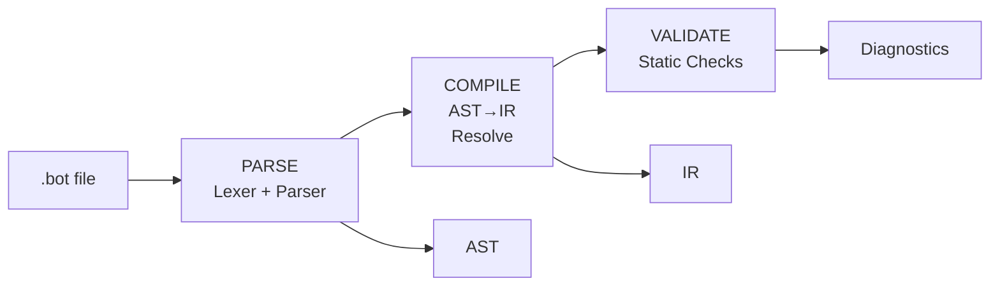
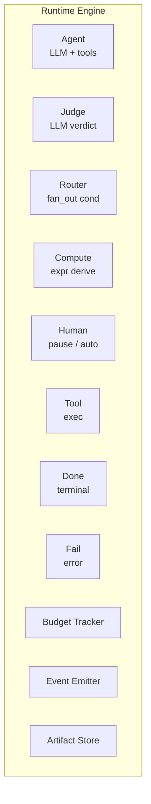

[← Documentation index](README.md) · [← Iterion](../README.md)

# Architecture

## Compiler Pipeline



1. **Parse** (`pkg/dsl/parser/`) — Indent-sensitive lexer + recursive-descent parser produces an AST
2. **Compile** (`pkg/dsl/ir/compile.go`) — Transforms AST to IR, resolves template references, binds schemas and prompts
3. **Validate** (`pkg/dsl/ir/validate.go`) — Static analysis with diagnostic codes spanning C001–C086 (sparse, ~60 codes today): reachability, routing correctness, cycle detection, schema validation, capability checks, cursor declarations, and more. See [references/diagnostics.md](references/diagnostics.md) for the full table.

## Runtime Engine



The engine walks the IR graph, executing nodes and selecting edges. Key runtime features:

- **Parallel branches** — router `fan_out_all` spawns concurrent branches, limited by `max_parallel_branches`
- **Workspace safety** — only one mutating branch at a time; multiple read-only branches are OK
- **Shared budget** — mutex-protected token/cost/duration tracking across all branches
- **Checkpoint-based pause/resume** — the checkpoint in `run.json` is the authoritative resume source
- **Event sourcing** — every step is recorded in `events.jsonl` for observability and debugging

**Run lifecycle:** local runs start as `running`; cloud-submitted runs may start as `queued` before a runner claims them. Runs may pause as `paused_waiting_human` and later resume to `running`, then finish as `finished`, `failed`, `failed_resumable` (checkpointed failure that can be resumed), or `cancelled`.

## Persistence

All run state is persisted under a configurable store directory (default: `.iterion/`):

```
.iterion/runs/<run_id>/
  run.json                     # Run metadata & checkpoint
  events.jsonl                 # Append-only event log
  artifacts/<node_id>/
    0.json, 1.json, ...       # Versioned node outputs
  interactions/<id>.json       # Human Q&A exchanges
  report.md                    # Generated run report
```

See [`persisted-formats.md`](persisted-formats.md) for the full specification.

## Architecture Decision Records

Significant architectural choices are documented under [`adr/`](adr/):

| ADR | Topic |
|-----|-------|
| [ADR-001](adr/001-round-robin-router-mode.md) | Round-robin router mode semantics |
| [ADR-002a](adr/002-desktop-assetserver-proxy.md) | Desktop AssetServer proxy architecture (Wails v2 + embedded `pkg/server`) |
| [ADR-002b](adr/002-editor-runview-separation.md) | Editor runview separation (event broker vs. run store) |
| [ADR-003](adr/003-privacy-tools-pure-go.md) | Pure-Go privacy tools (regex + Luhn/mod-97 + entropy, no ONNX sidecar) |
