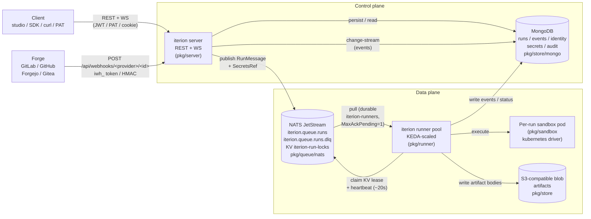

[← Documentation index](README.md) · [← BaaS overview](baas-overview.md)

# Cloud architecture

**Audience.** Anyone who needs the mental model behind the
multi-tenant platform — to debug a stuck run, design an integration,
or convince a security review that "yes, tenancy is enforced at the
store layer, not in the UI". Every component below has a real file in
[pkg/](../pkg/); the link beside each piece points there.

This page supersedes the old [cloud.md](cloud.md) (now a 20-line front
door) and complements [cloud-deployment.md](cloud-deployment.md) (the
operator runbook).

## Control plane vs data plane



The two halves are kept deliberately separate:

- The **control plane** (server + Mongo) is the source of truth for
  identity, multi-tenancy, secrets, audit, and run metadata.
- The **data plane** (NATS + runner pods + sandbox pods + S3) does the
  expensive work — LLM calls, tool execution, file mutation.

A failure in the data plane (a runner OOMs, NATS reboots, S3 is slow)
must not lose the run; the control plane keeps the canonical state and
the orphan sweeper closes the gap when the runner dies between claiming
a run and writing its terminal status (see
[baas-admin-guide.md → DLQ + orphan
sweeper](baas-admin-guide.md#17-dlq-triage)).

## The run lifecycle

| Status | Meaning |
|---|---|
| `queued` | Cloud-mode only: the publisher wrote `run.json`, sealed the credentials bundle, published a `RunMessage` onto NATS. No runner has claimed it yet. |
| `running` | A runner pod has claimed the KV lease, opened the bundle, and is executing nodes. Heartbeats refresh the lease ~every 20s. |
| `paused_waiting_human` | A human node awaits input (`POST /api/runs/{id}/resume` with answers). Resumable. |
| `paused_operator` | Operator paused via the studio. Resumable. |
| `failed_resumable` | Transient failure (LLM rate limit, timeout, budget exceeded, runner crash). Checkpoint preserved; `iterion resume` / studio Retry brings it back. |
| `failed` | Definitive — `FailNode` reached, or first node failed before any checkpoint existed. |
| `cancelled` | Cancelled by the operator. Checkpoint preserved; resumable. |
| `finished` | Terminal success. |

Statuses are pinned in
[pkg/store/run.go:RunStatus](../pkg/store/run.go).

## Sealed credentials bundle lifecycle

Each cloud run carries its credentials through the queue in a sealed
envelope so the runner pod gets exactly what it needs and nothing else
([pkg/secrets/run_secrets.go](../pkg/secrets/run_secrets.go)):

```
   server (publisher)                              runner pod
   ──────────────────                              ──────────
   1. resolve BYOK keys + bindings + OAuth         5. fetch RunSecretsRecord by ref
      for (tenant, user, bot)                        from Mongo
   2. assemble RunBundle{                          6. OpenRunBundle with AAD
        APIKeys, GenericSecrets,                      "run_secrets:<run_id>"
        GenericSecretHosts, OAuthCredentials      7. inject into engine ctx
      }                                            8. on terminal status:
   3. SealRunBundle → sealed_blob                     Delete(ref)
      (AES-GCM, AAD=run_secrets:<run_id>)
   4. write RunSecretsRecord{                      Mongo TTL: 24h on the record so
        _id = NewSecretsRef(),                      an abandoned bundle never
        sealed_bundle = sealed_blob,                lingers (Resume re-publishes
        expires_at = now+24h                        and re-resolves).
      }
      then publish RunMessage{ ..., SecretsRef }
```

The bundle is opaque to NATS — the queue carries the ref, not the
payload. A runner without `ITERION_SECRETS_KEY` (or with the wrong key)
fails at `OpenRunBundle` with `secrets: authentication failed`, the
runner Nak's, and the message redelivers. Get this wrong on a stable
deploy and **every** workflow fails at "fetch run_secrets" (see
[cloud-admin.md
§11](cloud-admin.md)).

## Queue internals

Conventions are pinned in
[pkg/queue/nats/nats.go](../pkg/queue/nats/nats.go) — every constant
matches plan §C.2:

| Resource | Default name | Purpose |
|---|---|---|
| Stream | `ITERION_RUNS` | Live runs queue |
| DLQ stream | `ITERION_RUNS_DLQ` | Parked messages (max-deliver-exhausted) |
| Subject | `iterion.queue.runs` | Where the publisher writes |
| DLQ subject | `iterion.queue.runs.dlq` | DLQ park subject |
| KV bucket | `iterion-run-locks` | Distributed lease per run id |
| Durable consumer | `iterion-runners` | The pull-consumer the runner pool drains |

Pinned semantics:

- **`MaxAckPending = 1`** on the consumer — one in-flight run per
  runner pod. Horizontal scale is "more pods" via KEDA.
- **`AckWait = 5min`** with periodic `InProgress()` heartbeats so a
  long LLM step doesn't trigger redelivery while it's still healthy.
- **KV lease**: TTL 60s, refreshed every 20s by the runner's
  `heartbeat` goroutine
  ([pkg/runner/loop.go](../pkg/runner/loop.go)). If three refreshes
  fail, the runner self-cancels its own run to avoid split-brain
  (`iterion_runner_heartbeat_errors_total` bumps).
- **`MaxDeliver = 3`** — third NAK parks a copy on the DLQ stream
  (header `Iterion-DLQ-Reason: <err>`) and the runner CAS-flips the
  run to `failed_resumable`
  ([pkg/runner/loop.go](../pkg/runner/loop.go), look for "parking on
  DLQ"). The original NATS message is Term'd; the DLQ copy is the
  recoverable artifact.
- **DLQ retention**: 7 days
  ([pkg/queue/nats/nats.go:DefaultDLQMaxAge](../pkg/queue/nats/nats.go)).
  An operator triages via the admin endpoints
  ([baas-admin-guide.md
  §1.7](baas-admin-guide.md#17-dlq-triage)).

The **orphan sweeper** runs on the server side
([pkg/server/queue_sweeper.go](../pkg/server/queue_sweeper.go)) and
catches the failure mode the runner can't — the pod that died before
even claiming the run, or before its first status write. It scans
every 60s for `queued > 20min` or `running > 10min` AND no current
NATS-KV lease, then CAS-flips matched rows to `failed_resumable`.
Bumps `iterion_runs_orphan_recovered_total`.

The same sweeper also polls `DLQDepth()` so
`iterion_dlq_depth` is kept fresh — that's what the
`IterionDLQNotEmpty` alert in the starter pack fires on.

## Multitenancy enforcement layers

Four boundaries, each fail-closed:

1. **HTTP middleware** validates the credential and stamps an
   `auth.Identity{UserID, TeamID, Role, IsSuperAdmin}` on the ctx.
   JWT, PAT, and webhook auth all converge here
   ([pkg/server/middleware.go](../pkg/server/middleware.go),
   [pkg/server/middleware_webhook.go](../pkg/server/middleware_webhook.go)).
2. **Route guards**: `canViewTeam` / `canManageTeam` /
   `requireSuperAdmin` cross-check the URL's `{id}` against the
   identity's team and role.
3. **Store ctx**: `store.WithIdentity(ctx, tenantID, userID)` is
   re-stamped onto the ctx before every store call so the Mongo
   adapters filter `tenant_id = ...` automatically — handlers can't
   forget it.
4. **Mongo adapter**: every collection (`runs`, `events`,
   `api_keys`, `generic_secrets`, `bot_secret_bindings`, `audit_log`,
   `webhook_configs`, `webhook_deliveries`, `org_usage`,
   `password_resets`, `pats`, `memory_*`) carries `tenant_id` on every
   row + a compound index that starts with it. Reads without a tenant
   ctx **fail-close** (`ErrBindingTenantMissing` and friends), not
   "show everything".

The one deliberate cross-tenant case is `visibility=global` memory: a
super-admin write produces an audit row through the admin path, and
the FS adapter / Mongo adapter both treat it as untenanted.

## Where each metric is emitted

| Metric | Emitter | When |
|---|---|---|
| `iterion_runs_created_total{status}` | server | At every Launch/Resume publish |
| `iterion_runs_active{status="running"}` | runner | Sum across pods = in-flight runs |
| `iterion_run_duration_seconds{status}` | runner | On terminal status |
| `iterion_ws_connections` | server | WS open / close |
| `iterion_mongo_change_stream_lag_seconds` | server | Per event delivered |
| `iterion_nats_pending_messages` | runner | Polled every 15s |
| `iterion_workspace_clone_duration_seconds` | runner | Per workspace clone |
| `iterion_llm_tokens_total{backend,model,direction}` | runner | Per LLM call |
| `iterion_llm_cost_usd_total{backend,model}` | runner | Per claw-priced call (delegate calls don't carry a price table) |
| `iterion_runner_heartbeat_errors_total` | runner | Per KV refresh failure |
| `iterion_webhook_deliveries_total{provider,status}` | server | Per delivery (terminal status) |
| `iterion_webhook_throttled_total{provider,reason}` | server | Pre-handler throttle (rate / quota) |
| `iterion_auth_logins_total{result}` | server | Login attempts |
| `iterion_auth_password_resets_total{step}` | server | Reset flow (`requested`, `confirmed`) |
| `iterion_launch_denied_total{reason}` | server | Launch gate refusals |
| `iterion_runs_orphan_recovered_total` | server | Sweeper flips |
| `iterion_dlq_depth` | server | Sweeper poll of NATS state |

All from a shared registry in
[pkg/cloud/metrics/metrics.go](../pkg/cloud/metrics/metrics.go) so the
PodMonitor scrapes both binaries with identical metric names.
Tenant labels are deliberately absent on every counter (cardinality
discipline; per-org accounting lives in Mongo).

## Run-completion callbacks vs inbound webhooks

The two webhook directions are intentionally separate features:

- **Inbound** (this whole doc): the forge / CI / custom caller fires an
  iterion run. See [webhooks.md](webhooks.md).
- **Outbound** (run-completion callbacks): the run, when it terminates,
  POSTs back to a URL the launcher supplied. See
  [outbound-callbacks.md](outbound-callbacks.md). Used to deliver the
  final answer to a chat bot without polling, with optional HMAC
  signing via `ITERION_COMPLETION_WEBHOOK_SECRET`.

The runner emits the callback after every terminal status transition,
firing once. Webhook URLs are SSRF-vetted (loopback / RFC-1918 /
metadata-IP refused by default — see the outbound doc for the
self-hosted relaxation).
