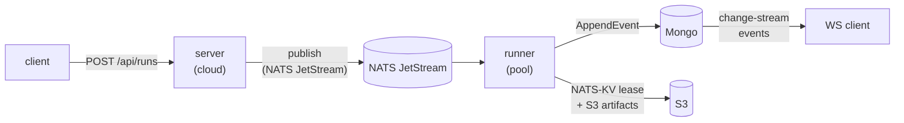

# Cloud deployment

This document is the operator runbook for the cloud-mode topology
(`iterion server` + `iterion runner` + Mongo + NATS JetStream + S3).
It covers prerequisites, secret + token lifecycle, NetworkPolicy
egress, observability, resume, and migration from a filesystem store.

The Helm chart is published to GHCR as an OCI artifact at
`oci://ghcr.io/socialgouv/charts/iterion` (sources in
[charts/iterion/](../charts/iterion/)). It renders the full stack;
values-dev.yaml bundles in-cluster Mongo / NATS / MinIO for smoke
tests, values-prod.yaml expects external dependencies.

## Install

```bash
helm install iterion oci://ghcr.io/socialgouv/charts/iterion \
  --version <semver> \
  --namespace iterion --create-namespace \
  -f values.yaml
```

Pick `<semver>` from the [iterion releases](https://github.com/SocialGouv/iterion/releases);
the chart `version` is kept in lock-step with the binary `appVersion`,
so `helm install --version 0.5.3` deploys the iterion 0.5.3 image.

OCI registries do not expose a `helm search repo` index; to inspect a
chart before installing, pull it explicitly:

```bash
helm pull oci://ghcr.io/socialgouv/charts/iterion --version <semver>
tar -tzf iterion-<semver>.tgz | head
```

For chart hacking against unreleased changes, install from a checkout:
`helm install iterion ./charts/iterion -f values.yaml`. `task chart:kind`
exercises this path end-to-end on a kind cluster.

## Topology



For the fuller control-plane / data-plane view, see [cloud-architecture.md](cloud-architecture.md).

- **server** publishes RunMessages onto JetStream and serves the
  studio + run console (REST + WebSocket).
- **runner** pulls RunMessages, claims a NATS-KV lease, executes the
  workflow, and writes events + artifacts to Mongo + S3.

## Prerequisites

| Component | Requirement |
|---|---|
| Kubernetes | 1.28+ for `context.WithoutCancel` semantics + native `Probe.gRPC` (optional) |
| CNI | NetworkPolicy enforcement enabled (Calico, Cilium, Antrea) when `networkPolicy.enabled=true` |
| MongoDB | 6.0+ with **replica set** (change-streams require an oplog) |
| NATS | 2.10+ with JetStream enabled |
| S3-compatible | bucket pre-created with `s3:ListBucket`, `s3:GetObject`, `s3:PutObject`, `s3:DeleteObject` for the IAM principal |
| KEDA (optional) | 2.13+ if `runner.keda.enabled=true` |
| Prometheus Operator (optional) | for `metrics.podMonitor.enabled=true` |

## Auth bundle and access tokens

Every cloud server requires an auth bundle at boot:

| Env var | Purpose | Generate with |
|---|---|---|
| `ITERION_JWT_SECRET` | Server-side HS256 signing key for short-lived access JWTs (at least 32 random bytes) | `openssl rand -base64 48` |
| `ITERION_SECRETS_KEY` | AES-256-GCM master key for sealing BYOK, OAuth, and run-scoped credentials (exactly 32 bytes before base64) | `openssl rand -base64 32` |

Without those values, cloud-mode validation aborts with an explicit
error (use `ITERION_DISABLE_AUTH=true` only for local smoke tests, not
for shared deployments). The server pods need `ITERION_JWT_SECRET`;
both server and runner pods must agree on `ITERION_SECRETS_KEY` so
runners can unseal the credential bundle attached to each run.

Generate + apply the Secret:

```bash
kubectl create secret generic iterion-auth \
  --from-literal=ITERION_JWT_SECRET="$(openssl rand -base64 48)" \
  --from-literal=ITERION_SECRETS_KEY="$(openssl rand -base64 32)" \
  --from-literal=ITERION_BOOTSTRAP_ADMIN_EMAIL=ops@example.com \
  --namespace iterion
```

Reference it from values-prod.yaml:

```yaml
secrets:
  auth:
    existingSecret: iterion-auth
```

On the first boot of an empty users collection,
`ITERION_BOOTSTRAP_ADMIN_EMAIL` creates a super-admin account with a
one-time password printed in the server logs. Capture that password,
sign in, change it, and remove the bootstrap env var on the next deploy.

API clients do not send a static deployment token. They authenticate
with an access JWT issued by login/refresh, passed as
`Authorization: Bearer <access-jwt>` or via the `iterion_auth` cookie.
WebSocket clients that cannot set headers may pass the same access JWT
as `?t=<access-jwt>` on `/api/ws/*`. Health probes, server info, and
auth bootstrap routes remain public.

For rotation details, including JWT signing-key rotation and
`ITERION_SECRETS_KEY` impact, see [cloud-admin.md](cloud-admin.md).

## NetworkPolicy egress

`values-prod.yaml` ships with `networkPolicy.enabled=true` + an empty
`extraAllow` so the cluster default-denies egress except DNS. Add
explicit rules for Mongo, NATS, S3, and the LLM provider:

```yaml
networkPolicy:
  enabled: true
  extraAllow:
    # In-cluster Mongo (same namespace)
    - to:
        - podSelector:
            matchLabels:
              app.kubernetes.io/name: mongodb
      ports:
        - protocol: TCP
          port: 27017
    # External LLM provider (Anthropic)
    - to:
        - ipBlock:
            cidr: 0.0.0.0/0
      ports:
        - protocol: TCP
          port: 443
```

The chart synthesises a single egress block from the union of
defaults + `extraAllow`. There is no auto-detection of bundled
sub-charts; if you also bundle Mongo via `mongodb.enabled`, add the
matching `extraAllow` entry.

## NATS monitoring endpoint (KEDA)

KEDA's NATS JetStream scaler scrapes `/jsz` on the **monitoring**
port (8222 by default), not the client URL. The chart helper
`iterion.nats.monitoringEndpoint` resolves to:

1. `.Values.config.nats.monitoringEndpoint` if set, else
2. `<release>-nats:8222` for bundled NATS, else fails.

For external NATS:

```yaml
config:
  nats:
    url: nats://nats.shared:4222          # JetStream client port
    monitoringEndpoint: nats.shared:8222  # /jsz scrape
```

## Metrics & dashboards

The server + runner expose `/metrics` on `:9090` (configurable via
`config.metrics.port`). Counters/gauges are documented at
[pkg/cloud/metrics/metrics.go](../pkg/cloud/metrics/metrics.go) and
populated at runtime:

| Metric | Pod | Meaning |
|---|---|---|
| `iterion_runs_created_total{status}` | server | Every Launch/Resume publish |
| `iterion_runs_active{status="running"}` | runner | Sum across pods = in-flight runs |
| `iterion_run_duration_seconds{status}` | runner | Histogram, terminal status |
| `iterion_ws_connections` | server | Live run-console subscribers |
| `iterion_mongo_change_stream_lag_seconds` | server | Set on each delivered event |
| `iterion_nats_pending_messages` | runner | Polled every 15s from JetStream consumer |
| `iterion_llm_tokens_total{backend,model,direction}` | runner | input/output/cache_read/cache_write |
| `iterion_llm_cost_usd_total{backend,model}` | runner | Reserved (not yet emitted by hooks) |
| `iterion_runner_heartbeat_errors_total` | runner | Each KV lease refresh failure |

Wire a Prometheus PodMonitor:

```yaml
metrics:
  podMonitor:
    enabled: true
    interval: 30s
```

`/metrics` is **ClusterIP-only** by design — no ingress should expose
it publicly.

## Tracing

The server + runner emit OpenTelemetry spans:

- `iterion.api.launch_run`, `iterion.api.resume_run` (server)
- `iterion.runner.process_one` (runner, root span per run)
- `iterion.node.execute` (engine, child span per node)

Trace context propagates through the W3C `traceparent` header on the
NATS RunMessage so a single trace covers `client → server → queue →
runner → node graph`.

Configure the OTLP exporter via standard env vars:

```yaml
config:
  env:
    OTEL_EXPORTER_OTLP_ENDPOINT: "http://tempo.observability:4318"
    OTEL_SERVICE_NAMESPACE: "iterion"
    OTEL_RESOURCE_ATTRIBUTES: "deployment.environment=prod"
```

When `OTEL_EXPORTER_OTLP_ENDPOINT` is unset, spans are dropped and the
W3C propagator-only path is installed (inbound trace context still
respected, but no export).

## Resume from a paused / failed run

Cloud-mode resume goes through the same NATS path as launch. The
client passes the inline `source` of the workflow because the server
pod has no operator filesystem:

```bash
curl -X POST https://iterion.example.com/api/runs/$RUN_ID/resume \
  -H "Authorization: Bearer $ITERION_ACCESS_TOKEN" \
  -H "Content-Type: application/json" \
  -d '{
    "source": "'"$(jq -Rs . workflow.iter)"'",
    "answers": {"approved": true},
    "force": false
  }'
```

`force=true` bypasses the workflow-hash mismatch guard (useful after a
local fix). The runner reads the flag from the RunMessage and applies
it to `runtime.New(WithForceResume)`.

## Migration from filesystem store

`iterion migrate to-cloud` uploads runs from a local `.iterion/`
directory into Mongo + S3. Idempotent (Mongo upserts + S3 PUT
overwrites):

```bash
ITERION_MONGO_URI=mongodb://...?replicaSet=rs0 \
ITERION_MONGO_DB=iterion \
ITERION_S3_ENDPOINT=https://s3.amazonaws.com \
ITERION_S3_BUCKET=iterion-prod \
ITERION_S3_REGION=eu-west-3 \
  iterion migrate to-cloud --store-dir ./.iterion --concurrency 4 --tenant <tenant-id> --owner <user-id>
```

Migration flags:

| Flag | Description |
|---|---|
| `--store-dir <path>` | Filesystem `.iterion/` store to migrate from (default `.iterion`). |
| `--config <path>` | YAML config file for Mongo/S3 settings; environment variables take precedence. |
| `--dry-run` | Print what would be uploaded without writing to Mongo or S3. |
| `--concurrency <n>` | Number of parallel run uploads (default `4`). |
| `--tenant <id>` | Tenant ID assigned to migrated runs; required for multitenant cloud deployments. |
| `--owner <id>` | Optional owner user ID attributed to migrated runs. |

Re-run safely if interrupted; runs already in Mongo are no-ops.

## Smoke test (`task chart:kind`)

```bash
devbox run -- task chart:kind
```

Renders + lints the chart, checks `appVersion` matches `package.json`.
For a real install + workflow exec, see the `cloud-e2e` CI job in
[.github/workflows/tests.yml](../.github/workflows/tests.yml).

## Health endpoints

| Path | Behaviour |
|---|---|
| `/healthz` | 200 if the HTTP listener is up — covers liveness probe |
| `/readyz` | Pings Mongo + NATS + S3 with 1s sub-deadline each, 503 on any failure — covers readiness probe |

The `/readyz` JSON response details which dependency is failing so the
operator can debug from `kubectl describe pod`.
