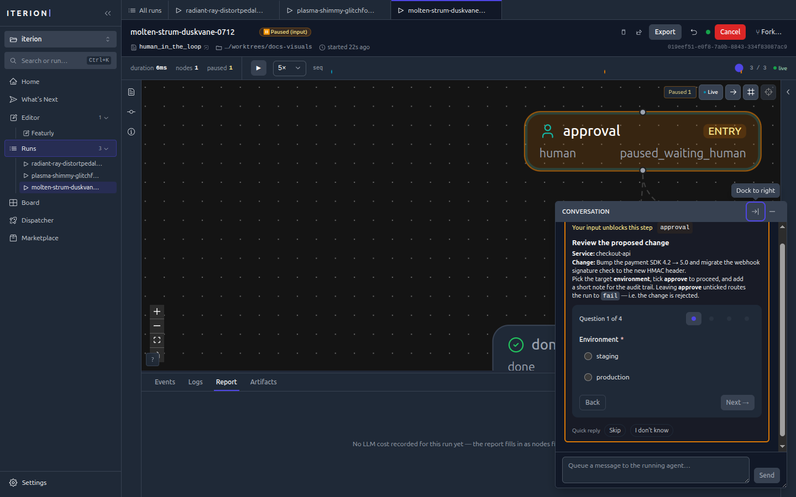
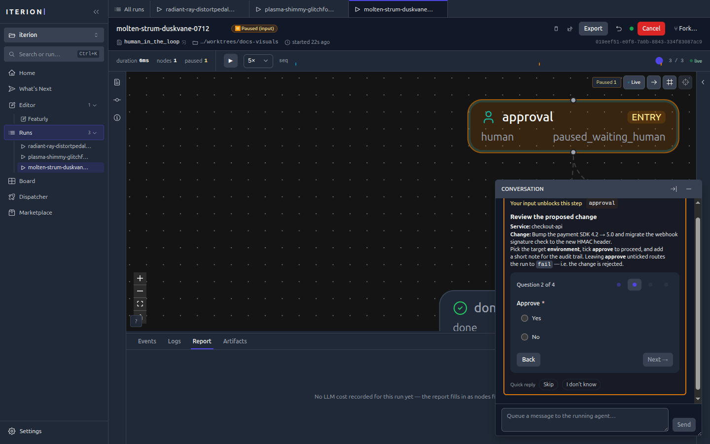
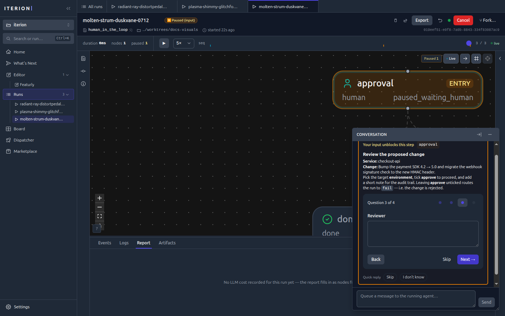
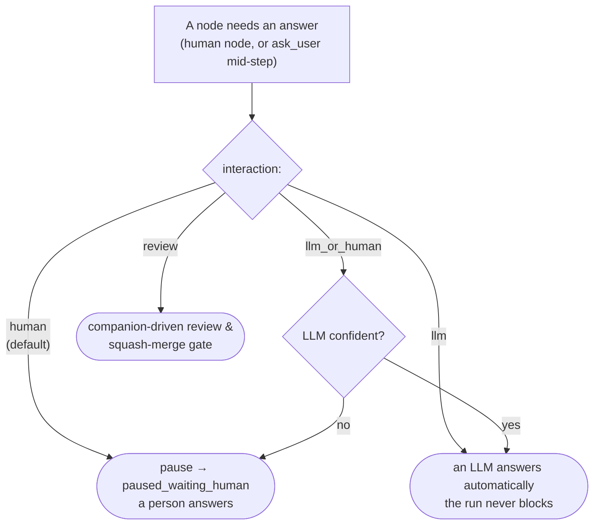

[← Documentation index](README.md) · [← Iterion](../README.md)

# Human in the loop

Most iterion nodes run unattended. But some decisions want a person —
an approval before a deploy, a missing requirement only a human knows, a
"does this look right?" gate before a merge. Iterion makes that a
first-class, **resumable** part of the graph: a run can pause, wait for a
human (for seconds or for days), and pick up exactly where it left off.

This page covers the `human` node, the four interaction modes, the form
the studio renders, and every way to answer (studio, CLI, HTTP).

## The `human` node

A `human` node presents **instructions** (rendered markdown) and collects
answers shaped by its **output schema**. When the run reaches it, it
emits `human_input_requested`, writes the question to
`interactions/<id>.json`, and transitions the run to
`paused_waiting_human` — a durable, resumable checkpoint (see
[resume.md](resume.md)).

```
human approval:
  instructions: approval_instructions   # a prompt: block, shown as markdown
  output: approval_decision             # the schema → drives the form widgets
  interaction: human                    # default for human nodes (see modes below)
```

The output schema is the form. Each field type maps to a widget:

| Schema field | Widget |
|---|---|
| `string` | text field / multi-line text area |
| `string [enum: "a", "b", …]` | single-select (radio / dropdown) |
| `bool` | Yes / No |
| `int`, `float` | number field |
| `string[]` | repeatable list |

The studio walks the fields one question at a time, with the
`instructions:` markdown pinned above:



Different field types render their matching widget — a `bool` as Yes / No,
a `string` as a free-text area:





## Try it — a minimal example

[`examples/human-in-the-loop.bot`](../examples/human-in-the-loop.bot) is
a self-contained demo whose **entry** node is a `human` node, so it pauses
immediately — no LLM, no tools, free to run:

```bash
iterion run examples/human-in-the-loop.bot
# → Status: PAUSED (waiting for human input)

# answer it headless and let it route to done/fail:
iterion resume --run-id <id> \
  --answer environment=staging --answer approve=true \
  --answer reviewer="Ada" --answer notes="LGTM"
```

…or open the run in the studio (`iterion studio`) and fill the form in
the run console.

## Interaction modes

A node's `interaction:` field decides **who answers**. The default for a
`human` node is `human` (always pause); the others let an LLM stand in,
fully or conditionally.



| Mode | Behaviour | Use it when |
|---|---|---|
| `human` | Always pause for a person. | Approvals, gates, anything needing real judgment. |
| `llm` | An LLM answers automatically; the run never blocks. | Unattended pipelines, chat bots that must not stall (e.g. [`examples/clarify/main.bot`](../examples/clarify/main.bot)). |
| `llm_or_human` | The LLM answers when confident, else escalates to a human. | Cut routine pauses while keeping a human backstop. |
| `review` | A companion LLM walks a reviewer through testing the change, ending in a squash-merge — see [review-merge-gate.md](review-merge-gate.md). | Ship gates. |

Modes are also why the same workflow can run fully autonomously in cloud
mode (LLM answers) and interactively on a desk (human answers) with no
graph changes.

## Conversational human gates (Nexie & co.)

Bots like **Nexie** ([`whats-next`](../bots/whats-next/)) use `human`
nodes as a back-and-forth: the studio surfaces the question inline in the
run's conversation, you reply in prose, and you can also **queue a message
to the running agent** to steer it mid-step.


## Answering a paused run

A `paused_waiting_human` run is resumable from anywhere:

- **Studio** — open the run; the form is in the run console's conversation
  panel. Answer and the run resumes live.
- **CLI** — `iterion resume --run-id <id> --answer key=value` (repeatable)
  or `--answers-file answers.json`. Values are coerced to the schema
  (`"true"` → `bool`, enum membership checked).
- **HTTP** — `POST /api/runs/{id}/resume` with the answers map (this is
  what cloud webhooks and the SDK use).

Every exchange is persisted to `interactions/<id>.json`, so the question,
the answers, and who answered are all part of the run's auditable record
([persisted-formats.md](persisted-formats.md)).

## See also

- [dsl.md](dsl.md) — `human` node + `interaction:` syntax reference
- [resume.md](resume.md) — pause/resume/failure matrix
- [review-merge-gate.md](review-merge-gate.md) — the `interaction: review` gate
- [visual-editor.md](visual-editor.md) — the run console that renders forms
