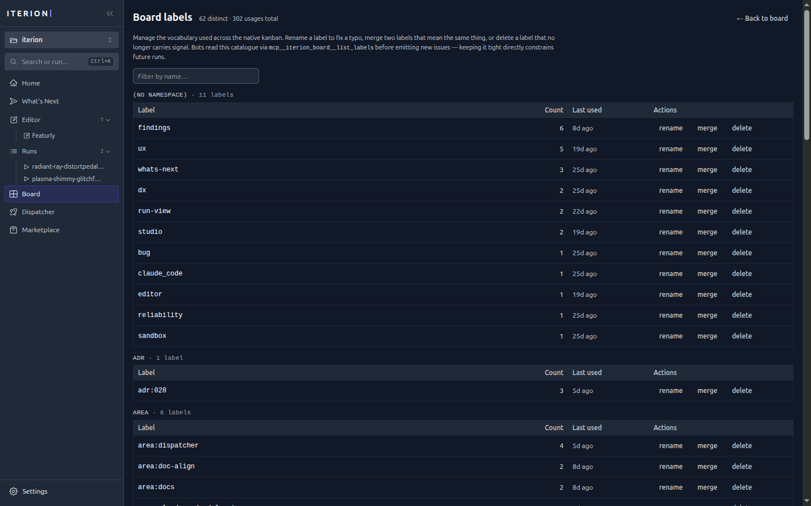

# Native kanban tracker

Iterion ships with a first-class issue tracker — no Linear, no GitHub
account required. It is the default backing store for
[`iterion dispatch`](dispatcher.md), but is fully usable on its own
through the `iterion issue` CLI or the studio's Board view.

The native tracker is a deliberate design choice: iterion's autonomous
loop should not require the operator to lock themselves into a
proprietary issue tracker. External adapters (`github`, `forgejo`) are
optional plug-ins, not the source of truth.

The studio's Board view (`/board`) is a drag-and-drop front end over
this store — cards carry labels, priorities, and per-card bot assignees:


A label manager (`/board/labels`) keeps the vocabulary tight — bots read
this catalogue before emitting new issues, so renaming or merging a label
directly constrains future runs:



## Storage layout

```
<store-dir>/dispatcher/
  board.json                  # column + custom-field schema
  issues/<encoded-id>.json    # one file per issue
  events.jsonl                # append-only audit log (monotonic Seq)
```

`<store-dir>` is the same directory the runtime store uses (resolved
via [`store.ResolveStoreDir`](../pkg/store/storedir.go)). Issue IDs
are `native:<uuid>` on the wire; the colon is illegal in NTFS
filenames, so the on-disk encoding swaps it for `__`.

Writes are serialized through a single mutex. Each mutation appends
one record to `events.jsonl`. The event types are:

`issue_created`, `issue_updated`, `issue_state_changed`,
`issue_deleted`, `issue_claimed`, `issue_released`,
`issue_last_run_updated`, `board_updated`.

The dispatcher stamps every issue it processes with `last_run_id`
(the run that handled it) + `last_workdir` (the worktree path on
the host) when the run finishes — success, failure, or cancel.
The studio's Board view surfaces these as a "Last run" panel on the
issue modal with a link back to `/runs/<id>` and a
`vscode://file/<path>` shortcut to open the worktree.

## Board

`board.json` defines what columns exist on the kanban and what custom
fields the operator can attach to issues. Defaults:

```jsonc
{
  "states": [
    { "name": "inbox",       "display": "Inbox" },
    { "name": "backlog",     "display": "Backlog" },
    { "name": "ready",       "display": "Ready",       "eligible": true },
    { "name": "in_progress", "display": "In progress", "eligible": true },
    { "name": "review",      "display": "Review" },
    { "name": "done",        "display": "Done",        "terminal": true },
    { "name": "blocked",     "display": "Blocked",     "terminal": true }
  ],
  "fields": []
}
```

`inbox` is the leftmost state. Bots with `board.create` capability
post their out-of-scope observations there (labeled `findings`) so
operators can triage on /board without a separate inbox surface —
drag inbox → backlog to promote, delete the card to dismiss.

| Property            | Meaning                                                            |
|---------------------|--------------------------------------------------------------------|
| `eligible: true`    | Dispatcher will dispatch issues sitting in this state.              |
| `terminal: true`    | Dispatcher treats this state as a stop signal; blocker dependencies | 
|                     | resolve.                                                           |

A state can be both `eligible` and `terminal` — for example a
`completed` column that triggers a final wrap-up workflow before
issues leave the board.

### Custom fields

A board may carry typed custom fields. Schema is enforced on every
issue write — unknown fields and bad types are rejected.

```jsonc
{
  "states": [...],
  "fields": [
    { "name": "severity",  "type": "enum",   "enum_values": ["low", "medium", "high"], "required": true },
    { "name": "due_date",  "type": "date" },
    { "name": "story_pts", "type": "number" },
    { "name": "external",  "type": "bool" }
  ]
}
```

| `type`    | Value shape                                       |
|-----------|---------------------------------------------------|
| `text`    | string                                            |
| `number`  | int or float                                      |
| `bool`    | true / false                                      |
| `date`    | RFC3339 string                                    |
| `enum`    | string ∈ `enum_values`                            |

Field values are rendered into workflow inputs via
`{{issue.fields.<name>}}` in the dispatcher's `dispatch.vars` block.

## CLI — `iterion issue`

The full CLI works against `<store-dir>/dispatcher/` directly; it does
**not** need the dispatcher daemon to be running.

```
iterion issue create   --title T [--body B] [--state S] [--label L]+
                       [--priority N] [--assignee A] [--blocker ID]+
                       [--field key=value]+

iterion issue list     [--state S]+ [--label L]+ [--assignee A]
                       [--claimed] [--unclaimed]

iterion issue show     <id-or-prefix>
iterion issue move     <id-or-prefix>  --to <state>
iterion issue update   <id-or-prefix>  [--title T] [--body B] [--labels L1,L2]
                                       [--priority N] [--assignee A]
                                       [--field k=v]+ [--clear-field K]+
iterion issue close    <id-or-prefix>          # → first terminal state

iterion issue board show
iterion issue board init [--from <board.json>]
```

`<id-or-prefix>` accepts the full `native:<uuid>` form, the bare
UUID, or any uniquely-matching prefix (e.g. the first 8 characters
shown in `list`).

`--field key=value` infers the type from the value: `true`/`false` →
bool, integers / floats → number, everything else → string. Use
`--clear-field key` to unset a value.

`iterion issue list` accepts `--json` (the global flag) to emit
machine-readable output:

```bash
iterion issue list --state ready --json | jq '.[].id'
```

### Open CLI gap: per-ticket `bot` / `bot_args`

The underlying `native.Issue` record carries dedicated typed
fields `Bot` (string) and `BotArgs` (`map[string]string`) — see
the REST surface below — but `iterion issue create` and
`iterion issue update` do **not** yet expose `--bot` or
`--bot-arg` flags. `--field key=value` lands in the freeform
`Fields` map, NOT in `BotArgs`.

Until the CLI ships those flags, set the two routing fields via
one of:

- the REST API (`POST` / `PATCH` `/api/v1/native/issues` with
  `{ "bot": "feature_dev", "bot_args": { "feature_prompt": "…" } }`),
- a direct `native.Store.Create` / `Update` call from Go,
- or rely on the dispatcher-side `assignee_workflows:` /
  `assignee_dispatch:` mappings keyed on `--assignee` (see
  [docs/dispatcher.md](dispatcher.md)).

## REST surface

When iterion runs an HTTP server (`iterion studio` or `iterion
dispatch`'s embedded HTTP), the native tracker is exposed under
`/api/v1/native/`. Auth follows the surrounding server: the studio's
local mode is unauthenticated; cloud mode gates the routes through the
same JWT middleware as `/api/runs/*`.

| Endpoint                                     | Method | Body                                |
|----------------------------------------------|--------|-------------------------------------|
| `/api/v1/native/issues`                      | GET    | (query: `state`, `label`, `assignee`)|
| `/api/v1/native/issues`                      | POST   | `{title, body?, state?, labels?, priority?, assignee?, blockers?, fields?, bot?, bot_args?}` |
| `/api/v1/native/issues/{id}`                 | GET    | —                                   |
| `/api/v1/native/issues/{id}`                 | PATCH  | partial `{title?, body?, labels?, priority?, assignee?, blockers?, fields?, bot?, bot_args?}` |
| `/api/v1/native/issues/{id}`                 | DELETE | —                                   |
| `/api/v1/native/issues/{id}/transition`      | POST   | `{to: <state>}`                     |
| `/api/v1/native/board`                       | GET    | —                                   |
| `/api/v1/native/board`                       | PUT    | full `Board`                        |

`{id}` accepts the same prefix resolution as the CLI.

`bot` (string) and `bot_args` (`map[string,string]`) are
dedicated typed columns on the native `Issue` record; they are not
part of the freeform `fields` map. `bot_args` is merged on top of
the dispatcher's rendered `dispatch.vars` key-by-key at launch time,
with `bot_args` winning on shared keys. `bot` is resolved into the
dispatch request for custom runners/future routing, but the current
stock `EngineRunner` is precompiled for one workflow and does not use
the per-ticket `bot` field to override workflow selection. Use
`assignee_workflows:` in the dispatcher config for current stock
workflow routing. See [docs/dispatcher.md §Per-ticket bot + args
fields](dispatcher.md) for the current handoff.

The SPA's Board view (`/board` in the studio) consumes exactly these
endpoints — it's a thin React shell on top of the REST surface.

## Use cases beyond the dispatcher

Even without `iterion dispatch` running, the native tracker is useful
as a local kanban for:

- **Pre-flight backlog grooming.** Curate issues before flipping the
  switch on the dispatcher.
- **Per-project task lists.** The store lives under the same
  `<store-dir>` as your runs, so issues travel with the project.
- **Lightweight personal queue.** Replace a sticky-note `TODO.md`
  with something that survives reflows, accepts custom fields, and
  speaks JSON.

## Programmatic access

The Go package is exported:

```go
import "github.com/SocialGouv/iterion/pkg/dispatcher/native"

s, err := native.NewStore(storeDir + "/dispatcher")
if err != nil { return err }

iss, err := s.Create(native.Issue{Title: "do a thing", State: "ready"})
list, err := s.List(native.ListFilter{States: []string{"ready"}})
_, err = s.SetState(iss.ID, "in_progress")
err = s.Claim(iss.ID, "worker-1")
err = s.Release(iss.ID, "worker-1")
```

To plug it into the dispatcher's `Tracker` interface:

```go
adapter := native.NewAdapter(s) // satisfies tracker.Tracker
```

## Limitations (v1)

- **No comments.** Events.jsonl is the audit trail; user-facing
  comments are a v2 ergonomic.
- **No bi-directional sync with GitHub / Forgejo.** A single
  dispatcher instance picks one tracker. Mirroring is on the v2
  roadmap.
- **No persistent retry queue.** Restart loses in-flight backoff
  timers; the next tick re-discovers candidates via the tracker.
- **Migration on board.json changes is manual.** Renaming a state
  leaves existing issues in the old name, surfaced as "Unmapped" in
  the SPA. v2 will support an explicit migration step.
- **Field validation is closed-world.** Add a new `Field` to the
  board before writing any issue that references it.
