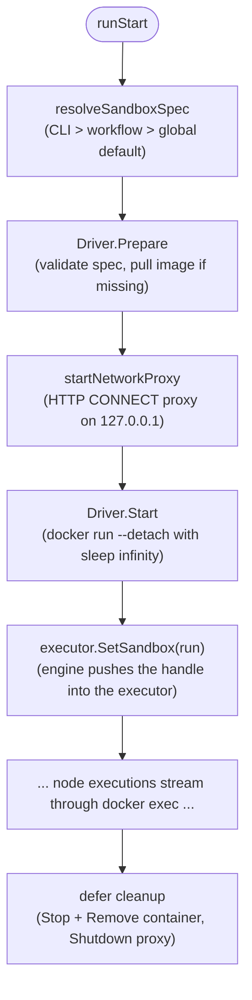

# iterion sandbox

The iterion sandbox provides per-run isolation for coding agents and
shell tool nodes via a Docker (or Podman) container. It is **opt-in**:
workflows that don't declare `sandbox:` and runs that don't pass
`--sandbox` execute exactly as they did before this feature shipped.

## Quick start

The shortest path to a sandboxed run:

1. Add (or reuse) a `.devcontainer/devcontainer.json` in your repo.
2. Set `sandbox: auto` on your workflow:

   ```iter
   workflow review:
     worktree: auto
     sandbox: auto
     entry: plan
   ```

3. Run the workflow as usual. iterion will pull the image, start the
   container, route claude_code, claw, and tool nodes through it, and
   tear the container down on exit.

To enable sandboxing without touching the workflow source, pass
`--sandbox=auto` to `iterion run`:

```bash
iterion run review.bot --sandbox=auto
```

## How it works

### Lifecycle



A **single container** hosts the entire run. Multiple `docker exec`
calls amortise the create+start cost over every claude_code, claw,
codex, or tool node invocation. The container's PID 1 is `sleep infinity` —
iterion deliberately ignores the image's CMD/ENTRYPOINT in favour of
treating the container as a long-lived "ssh-like" target.

### Workspace bind-mount

The host worktree (when `worktree: auto`) or repo (when `worktree: none`)
is bind-mounted RW into the container. The default mount target depends
on `host_state` (see below):

- `host_state: auto` (the default) — mounted at the **same absolute
  path as on the host**. This keeps absolute-path-derived state
  identical inside and outside the container (Claude Code project
  keys, prompts that reference `${PROJECT_DIR}`, tool nodes that pass
  absolute paths around).
- `host_state: none` or workflow that pins `workspace_folder` —
  mounted at the configured target (default `/workspace`).

Override via `workspaceFolder` in `.devcontainer/devcontainer.json`
or `workspace_folder:` in the inline `sandbox:` block.

### Host state mounts (`~/.iterion`, `~/.claude`)

When `host_state: auto` (the default), iterion also bind-mounts:

| Host path                | Container path           | Purpose |
|--------------------------|--------------------------|---------|
| `~/.iterion/` (or `$ITERION_HOME`) | same absolute path | Run store: events, artifacts, recoveries, the `runs/<id>/` tree. The in-container `iterion __claw-runner` writes here and host iterion reads it after the run. |
| `~/.claude/`             | same absolute path      | Claude Code OAuth credentials, per-project `projects/<key>/` chat history, user-level `CLAUDE.md`. Keeps memory persistent across runs. |

Both are RW. The container's `HOME` env var is set to the host home so
processes that resolve `~` land in the mounted tree (no EACCES against
a stock image's `/root`).

**UID remapping (Linux only):** when `host_state: auto` is active and
the spec doesn't pin a `User`, the docker driver runs the container as
`$(id -u):$(id -g)` so files written into the mounted trees stay owned
by the host user. Emitted as `sandbox_user_remap` in `events.jsonl`.
macOS / Windows Docker Desktop handle this implicitly via userns-remap
and need no intervention. Host UID 0 (CI runners) is a no-op.

If the spec pins a `User` that mismatches the host UID (a
devcontainer with `remoteUser: node` on a host UID ≠ 1000, for
example), iterion respects the spec and emits a
`sandbox_uid_mismatch_warning` so the operator knows why writes back
to the mounted trees may end up owned by an unexpected UID.

**Overlap handling:** when the workspace bind-mount already contains
one of the candidate paths (typically a project-local `<repo>/.iterion/`
opt-in store), the redundant host_state mount is skipped — Docker's
bind semantics would have the more-specific entry win anyway, but the
explicit skip keeps `docker inspect` readable.

**Opt-out and security.** Set `host_state: none` in the workflow,
pass `--sandbox-host-state=none`, or export
`ITERION_SANDBOX_HOST_STATE=none` to disable. This is the recommended
posture for **multi-tenant cloud runners and shared CI**: the RW mount
exposes `~/.claude/.credentials.json` (OAuth) to every exec in the
container, which is fine on a single-user dev box but a leak vector
on shared infrastructure. The `kubernetes` driver hard-errors on
`host_state: auto` for the same reason: cloud pods have no host
filesystem to bind and the design refuses to fake it.

Audit trail: the `sandbox_host_state_mounted` event in `events.jsonl`
lists the resolved source (CLI / workflow / env / default), the
container workspace path, and every mount that landed.

### Network policy

When a sandbox is active **with a non-open network policy**, an
iterion-managed HTTP CONNECT proxy runs on the host (127.0.0.1,
ephemeral port). The container receives the proxy URL via standard
`HTTPS_PROXY` / `HTTP_PROXY` env vars and reaches it via the
`host.docker.internal` alias.

**Default mode is `open`** — no proxy, full egress. Workflows that
need the stricter security-first posture opt in by declaring an
explicit `network:` block:

```yaml
sandbox:
  image: "ghcr.io/socialgouv/iterion-sandbox-full:edge"
  network:
    mode: allowlist
    preset: iterion-default
    rules:
      - "internal.acme.dev"
```

The shipped **`iterion-default`** preset is the recommended
starting point for allowlist mode: it covers the LLM endpoints
(anthropic, openai, openrouter, bedrock, googleapis, azure,
mistral) plus package registries (npm, PyPI, golang proxy) plus
code hosts (github, gitlab, bitbucket) plus apt mirrors. It is
**not** applied implicitly — operators name it explicitly so the
default-open posture and the curated-allowlist posture are
unambiguous from the YAML.

By default the proxy does NOT terminate TLS — only the CONNECT
host:port is inspected, and the encrypted bytes pass through
untouched. This is a cost/simplicity choice (no CA to mint, custody,
or inject), **not** a cert-pinning constraint: the clients iterion
runs (Claude Code, the Anthropic/OpenAI SDKs) are standard
trust-store clients with no certificate pinning — they work behind
TLS-inspecting proxies (Zscaler, CrowdStrike, mitmproxy) once the
proxy CA is trusted. That same property is what the opt-in
TLS-inspection mode (secret egress substitution, see the secrets
docs) relies on.

Pattern syntax (last-match-wins evaluation):

| Pattern              | Matches                                  |
| -------------------- | ---------------------------------------- |
| `api.anthropic.com`  | exact case-insensitive host              |
| `*.example.com`      | exactly one DNS label (`foo.example.com`) |
| `**.example.com`     | one or more labels (`a.b.example.com`)   |
| `**`                 | any host (the "open" sentinel)            |
| `1.2.3.4`            | IPv4 literal exact match                  |
| `10.0.0.0/8`         | CIDR range                                |
| `!pattern`           | exclusion (negation)                      |

Modes:

| Mode        | Behaviour for unmatched hosts             |
| ----------- | ----------------------------------------- |
| `allowlist` | deny                                      |
| `denylist`  | allow                                     |
| `open`      | accept everything (skips the proxy entirely; **the default**) |

**IP literals are refused by default in allowlist mode** even when
their hostname is allowed, which closes the cloud-metadata exfiltration
vector (169.254.169.254 etc.). Add explicit IP rules to relax.

Blocked requests surface to the run as a `network_blocked` event in
`events.jsonl`:

```json
{"type": "network_blocked", "data": {"host": "evil.site", "reason": "policy denial", "run_id": "..."}}
```

## Configuration surface

### `.iter` workflow

The DSL accepts both short-form modes and block-form inline specs:

```iter
workflow x:
  # Short form: read .devcontainer/devcontainer.json, or fall back to
  # the default image when no devcontainer is present.
  sandbox: auto

  # OR: explicit opt-out (overrides global/default settings).
  sandbox: none

  # OR: block form. When the block has image/build/env/mount/network
  # fields and no explicit mode, it compiles as mode: inline.
  sandbox:
    image: "ghcr.io/acme/workflow-sandbox:sha256..."
    # build:                         # mutually exclusive with image
    #   dockerfile: "Dockerfile"
    #   context: "."
    #   args:
    #     VERSION: "1.2.3"
    user: "1000:1000"
    workspace_folder: "/workspace"
    host_state: auto         # auto | none. Default: auto. Set "none"
                             # on multi-tenant / shared runners.
    post_create: "npm ci"
    env:
      NODE_ENV: "test"
    mounts: ["type=bind,source=${localEnv:HOME}/.cache,target=/cache"]
    network:
      mode: allowlist
      preset: "iterion-default"
      rules: ["api.github.com", "!evil.site"]
```

`sandbox: auto` reads `.devcontainer/devcontainer.json` from the
workspace if present; otherwise it falls back to the published
**iterion-sandbox-slim** image pinned to the running iterion version.
That fallback ships with `git`, Node 22, devbox, and Nix preinstalled,
so the typical "agent installs deps, edits code, opens a PR" workflow
runs out of the box. See [Default image](#default-image) below.

Block form without `mode:` is treated as `mode: inline`. You may also
write `mode: inline` explicitly. Inline mode must declare exactly one of
`image:` or `build:`. `image:` uses a pre-built image reference;
`build:` asks the local docker driver to run `docker buildx build`
against the workflow workspace before starting the container. `env:`,
`mounts:`, `network:`, `user:`, `workspace_folder:`, and
`post_create:` are copied into the runtime sandbox spec for both inline
and auto-mode fallback cases.

Per-node overrides accept the same short or block form on `agent`,
`judge`, and `tool`:

```iter
agent shell_helper:
  sandbox: none      # this node runs on the host even though the
                     # workflow has sandbox: auto

agent custom_env:
  sandbox:
    image: "python:3.12-bookworm"
    env:
      PIP_DISABLE_PIP_VERSION_CHECK: "1"
```

### CLI

```bash
iterion run foo.bot --sandbox=auto    # one-shot override
iterion run foo.bot --sandbox=none    # force off
iterion run foo.bot                   # use workflow + global default
iterion run foo.bot \
    --sandbox-default-image ghcr.io/socialgouv/iterion-sandbox-full:edge
                                       # override the auto-mode fallback image
iterion run foo.bot --sandbox-host-state=none
                                       # disable ~/.iterion + ~/.claude auto-mount
iterion sandbox doctor                 # report driver + capabilities
```

### Environment / project config

- `ITERION_SANDBOX_DEFAULT` — global default (`""`, `none`, or `auto`).
  Lowest precedence. Workflows and CLI override.
- `ITERION_SANDBOX_DEFAULT_IMAGE` — image ref used by `sandbox: auto`
  when no `.devcontainer/devcontainer.json` is found. Falls back to
  `ghcr.io/socialgouv/iterion-sandbox-slim:<iterion-version>` when
  unset. Overridden per-run by `--sandbox-default-image`.
- `ITERION_SANDBOX_HOST_STATE` — global default for the
  `~/.iterion` + `~/.claude` auto-mount (`""`, `auto`, or `none`).
  Defaults to `auto`. Set to `none` on multi-tenant / cloud runners
  to avoid leaking host OAuth credentials.

### Precedence (highest → lowest)

1. Per-node `sandbox:` declaration (DSL)
2. CLI `--sandbox` flag
3. Workflow-level `sandbox:` declaration (DSL)
4. `ITERION_SANDBOX_DEFAULT` env var
5. Implicit `none` (no sandbox)

The same chain applies to `host_state` via `--sandbox-host-state`,
`sandbox.host_state:` in the workflow block, and
`ITERION_SANDBOX_HOST_STATE`. The built-in default is `auto`.

## Default image

When `sandbox: auto` is in effect but no `.devcontainer/devcontainer.json`
is found in the workspace, iterion falls back to a published image
pinned to the running iterion version:

| Variant | Image                                                       | Contents                                                                                            |
| ------- | ----------------------------------------------------------- | --------------------------------------------------------------------------------------------------- |
| **slim** (default) | `ghcr.io/socialgouv/iterion-sandbox-slim:<version>` | git, curl, jq, Node 22, devbox + Nix                                                                |
| **full** (opt-in)  | `ghcr.io/socialgouv/iterion-sandbox-full:<version>` | slim + Go (+ `g`), Python 3, pnpm, fnm, direnv, gh, yq (mikefarah), kubectl, helm, k9s              |

Tags track iterion releases (`v1.2.3`) plus a rolling `edge` for main.
Snapshot/dev binaries pull the `:edge` tag.

**Why two variants?** The slim image is small enough to pull on
demand and supports the common workflow (the agent calls `devbox install`
against the workspace `devbox.json` to materialise its toolchain). The
full image trades extra MB at first pull for not having to install
common operator + language toolchains (Go, Node, Python, Kubernetes
CLIs, GitHub CLI, …) on every run.

**Selecting the full variant per-run:**

```bash
iterion run foo.bot \
  --sandbox-default-image ghcr.io/socialgouv/iterion-sandbox-full:edge
```

**Or globally:**

```bash
export ITERION_SANDBOX_DEFAULT_IMAGE=ghcr.io/socialgouv/iterion-sandbox-full:edge
```

**Bringing your own:** if neither variant fits, point the override at
your own image (must support `sleep infinity` as PID 1 — i.e. provide
`/bin/sh` and `sleep`). Or commit a `.devcontainer/devcontainer.json`
to the repo to disable the fallback for that workspace; iterion will
read the devcontainer instead.

### Devbox-ready devcontainer template

If you want a project-pinned toolchain instead of relying on the
implicit fallback, use the
[`examples/devcontainer-devbox/`](../examples/devcontainer-devbox/)
template: a `.devcontainer/devcontainer.json` extending
`iterion-sandbox-slim` plus a workspace `devbox.json`. Drop both at
your repo root and `sandbox: auto` will pick them up.

## Backend compatibility

| Backend       | Sandbox status                                        |
| ------------- | ----------------------------------------------------- |
| `claude_code` | **fully sandboxed** (CLI runs inside the container)   |
| `codex`       | partially sandboxed (host CLI; codex has its own internal sandbox) |
| `claw`        | **sandboxed via runner sub-process** (Phase 4 V1) — see below |
| Tool nodes    | **fully sandboxed** (`sh -c` runs inside the container) |
| MCP servers   | partially sandboxed (host-side stdio; container-side MCP servers in V2) |

### Claw backend in sandbox

The `claw` backend runs LLM + tools in-process by default. When a
sandbox is active, iterion forwards each claw call to a hidden
`iterion __claw-runner` sub-process inside the container, so the
LLM's tool calls (Bash, file edits) execute inside the sandbox
boundary instead of escaping to the host.

**Container requirement**: the container image must ship the
`iterion` binary on PATH. The production Dockerfile installs it; for
local sandboxes built from third-party images you can mount the host
binary in (subject to architecture matching) via `runArgs`:

```jsonc
// .devcontainer/devcontainer.json
{
  "image": "node:20-bookworm",
  "runArgs": [
    "-v", "/usr/local/bin/iterion:/usr/local/bin/iterion:ro"
  ]
}
```

**V2-1+ wire format**: bidirectional NDJSON envelopes between
launcher and runner (see `pkg/backend/delegate/envelope.go`). Each
line is one envelope of typed payload (`task`, `tool_call`,
`tool_result`, `ask_user`, `ask_user_answer`, `session_capture`,
`session_replay`, `event`, `result`). The launcher's
[delegate.Multiplexer] dispatches runner-initiated envelopes
(tool_call, ask_user, …) to handlers wired against the engine's
existing tool registry / MCP manager / ask_user channel; the runner
builds proxy ToolDef closures that round-trip each invocation back
across the channel.

**Status of V1 limitations**:

- ✅ **MCP-routed tools** are now visible to claw nodes inside the
  sandbox (V2-2). The launcher passes ToolDef metadata over the
  wire as [delegate.IOToolDef]; the runner builds proxy ToolDefs
  whose Execute closures emit `tool_call` envelopes; the launcher's
  multiplexer dispatches each call back to the original closure
  (which may close over the MCP manager, the engine's tool
  registry, or any custom dispatcher).
- ✅ **Mid-tool-loop ask_user** resume now works inside the sandbox
  (V2-3). The launcher-side ask_user ToolDef returns
  [*delegate.ErrAskUser] as it always has; the multiplexer encodes
  the typed payload into a [delegate.AskUserToolFail] field on the
  tool_result envelope; the runner-side proxy rebuilds a typed
  *ErrAskUser so the LLM loop's existing pause/resume path triggers
  identically inside and outside the sandbox.
- ✅ **Compaction-retry across the IPC** now works (V2-4). The
  runner ships a [model.SessionCaptureSink] that emits
  `session_capture` envelopes after every save into its local
  nodeSessionStore; the launcher's [delegate.MultiplexerHandler.OnSessionCapture]
  mirrors the snapshots into the host's nodeSessionStore so
  CompactAndRetry sees the latest history. On the retry spawn, the
  launcher seeds a `session_replay` envelope before the task
  envelope, the runner stashes the snapshot, then loads it into its
  local store once the task arrives so applySessionMessages
  prepends the replayed prior messages to the LLM's first call.

## Drivers

| Driver       | When selected                              | Status   |
| ------------ | ------------------------------------------ | -------- |
| `docker`     | host has `docker` on PATH                  | Phase 1 ✅ |
| `podman`     | host has `podman` on PATH (no `docker`)    | Phase 1 ✅ (shares the docker code path) |
| `kubernetes` | running in-cluster (`ITERION_MODE=cloud`)  | Phase 5 V1 ✅ + V2-5 NetworkPolicy |
| `noop`       | always available; emits `sandbox_skipped` event when an active mode is requested but no real driver is usable | ✅ |

`iterion sandbox doctor` reports which driver is selected on the
current host and what capabilities it advertises.

### Strict pre-flight (`--strict`)

`iterion sandbox doctor --strict [workflow.bot]` resolves the **exact
sandbox spec a run would use** — host detection + the workflow's
`sandbox:` block (when a file is given) + the same
`--sandbox` / `--sandbox-default-image` / `--sandbox-host-state` flags
`iterion run` accepts — and validates every config combination *before*
a run starts. It exits non-zero on any failure, and each failure carries
an actionable remediation hint. Misconfigs that previously surfaced ~30s
into a run with a cryptic Docker/K8s error are caught in ~1s.

```bash
iterion sandbox doctor --strict                          # host-level checks only
iterion sandbox doctor --strict workflow.bot            # validate the workflow's sandbox: block
iterion sandbox doctor --strict workflow.bot --target cloud   # validate cloud (k8s) compat from a laptop
iterion sandbox doctor --strict --json workflow.bot     # machine-readable report
```

Checks (each `pass` / `warn` / `fail`):

| Check | What it verifies | Failure means |
| ----- | ---------------- | ------------- |
| **driver available** | a real driver (not `noop`) is selectable for the active spec | install Docker/Podman, or `--sandbox-driver=noop` to bypass — **downgraded to `warn`** under an explicit cross-host `--target` (see below), so a valid cloud/local spec validates from a foreign host |
| **spec valid** | `Spec.Validate` (image XOR build, inline needs image, absolute `workspace_folder`, valid network mode/inherit, valid `host_state`) | fix the `sandbox:` block |
| **docker daemon** | the daemon answers `version --format {{.Server.Version}}` | start Docker Desktop / `systemctl start docker` |
| **spec safety** | no `source=` bind of `docker.sock`, `/proc`, `/sys`, or host credentials; no flag injection on image/user/workdir; no env-var name/value injection | remove/fix the offending bind, arg, or env var |
| **image resolvable** | the image tag resolves in its registry via `docker manifest inspect` — **no pull**; a locally-cached image short-circuits to pass | `fail` = tag not found; `warn` = registry auth/network (can't verify offline) |
| **k8s spec compatible** | the cloud (kubernetes) constraints: no `build:`, image required, numeric `user`, and the **`host_state`-vs-k8s mutual exclusion** (`host_state: auto` is rejected — pods have no host filesystem) | pin `image`, set `host_state: none`, set a numeric `user` |
| **k8s context** | a context is selected and the API server is reachable (in-cluster: service-account + `cluster-info`; off-cluster: `kubectl config current-context` + `cluster-info`) | `fail` in-cluster; `warn` off-cluster (this host is not a runner) |
| **network allowlist syntax** | `network.preset` resolves and every `network.rules` entry compiles (wildcards lead a label, CIDRs parse, one wildcard segment per rule) | fix the offending rule/preset |
| **driver capabilities** | the selected driver supports the requested features (build, mounts, remote user, postCreate) | choose a driver that supports them, or drop the feature |

The `--target` flag selects the battery: `auto` (default — follow the
selected driver), `cloud` (force the kubernetes / host-independent
battery so a cloud workflow can be validated from a laptop), or `local`
(force docker). When an explicit `--target` names a host class this host
cannot serve (e.g. `--target cloud` on a Docker-only laptop, or any
target on a host with no container runtime), the **driver available**
check is reported as `warn` instead of `fail` — local runtime
availability is irrelevant to a cross-host spec check, so a valid spec
still exits 0. A plain `--strict` with no/`auto` target on a
runtime-less host still fails (a genuine local misconfiguration).

**Exit codes:** a failed check exits **1** (host/spec misconfigured); a
bad file or flag exits **2** (usage error). Warnings never change the
exit code. `ITERION_SANDBOX_DOCTOR_TIMEOUT` (Go duration, default `5s`)
caps each shell-out probe so a hung daemon/registry surfaces fast.

### Pre-flight hook in `iterion run` (opt-in)

Set `ITERION_SANDBOX_PREFLIGHT=1` to make `iterion run` run the same
strict battery against the resolved spec *before* booting the engine.
Failures abort the run early (exit 2) with the remediation logged;
warnings are logged but do not abort. It is **off by default** — the
battery shells out to the Docker daemon and an image registry, so the
latency is only paid when the operator opts in (e.g. in CI, or the first
run of a long session). The dispatcher equivalent (one check per daemon
session) is a planned follow-up.

## Cloud (`ITERION_MODE=cloud`)

When iterion runs in-cluster (`iterion server` + `iterion runner`
deployed via the Helm chart) and `runner.sandbox.enabled: true` is
set, each sandboxed run is hosted in its own **sibling pod** in the
runner's namespace.

Architecture:

- The runner pod detects the in-cluster service-account token and
  selects the `kubernetes` driver. The factory's preference order
  on `HostCloud` is `kubernetes → noop`.
- For each iterion run, the driver renders a Pod manifest from
  the resolved `sandbox.Spec` (image, env, user, workspaceFolder,
  postCreate) and applies it via `kubectl apply -f -`.
- The pod's PID 1 is `sleep infinity`; subsequent delegate calls
  (claude_code / claw / tool nodes) reach in via `kubectl exec`.
- Workspace is provided by an `emptyDir` volume mounted at
  `/workspace`. Phase 5 V1 doesn't clone source from a remote;
  the runner's WorkDir is the bind-mount source.
- Cleanup deletes the pod (and its emptyDir) on run exit.

Security defaults applied to every sibling pod:

| Setting                          | Value                              |
| -------------------------------- | ---------------------------------- |
| `restartPolicy`                  | `Never`                            |
| `automountServiceAccountToken`   | `false`                            |
| pod `securityContext.runAsNonRoot` | `true`                           |
| `seccompProfile.type`            | `RuntimeDefault`                   |
| container `allowPrivilegeEscalation` | `false`                          |
| container `capabilities.drop`    | `[ALL]`                            |
| `runAsUser` / `runAsGroup`       | from `sandbox.user` (numeric form) |

RBAC: the chart provisions a `Role` (namespace-scoped, NOT
ClusterRole) granting the runner `pods:get/list/watch/create/delete`,
`pods/exec:create/get`, `pods/log:get/list`, `pods/status:get`.
Enable via:

```yaml
# values-prod.yaml
runner:
  sandbox:
    enabled: true
```

V1 limitations (deferred to V2):

- **Per-run NetworkPolicy** is now synthesised (V2-5): every sibling
  pod gets a NetworkPolicy locking egress to the runner pod's IP
  (proxy) plus DNS to `kube-system / k8s-app=kube-dns`. **Enforcement
  requires a NetworkPolicy-aware CNI** — Calico, Cilium, weave-net,
  kube-router. Default kindnetd / EKS VPC CNI without policy add-on
  do **not** enforce; the resource still applies cleanly but is a
  no-op. The CONNECT proxy continues to enforce hostname allowlist
  at the application layer regardless of CNI.
- **`sandbox.build`** (Dockerfile-at-run-start) is **rejected in
  cloud mode** — see "BuildKit (local docker only)" below for the
  rationale and the cloud-side workaround.
- ✅ **`sandbox.mounts`** now honours PVC / ConfigMap / Secret
  entries (V2-7). Mount string format mirrors the docker driver
  with k8s-native types:
  ```
  mounts:
    - "type=pvc,source=cargo-cache,target=/cargo"
    - "type=configmap,source=app-cfg,target=/etc/app.json,key=app.json,readonly"
    - "type=secret,source=db-creds,target=/secrets"
  ```
  Bind mounts are explicitly rejected — pods have no host
  filesystem; the error message points authors at the PVC
  alternative. PVCs must exist in the namespace before the run pod
  is admitted; iterion does not provision them. Secrets always
  mount with `defaultMode=0400`.
- **Image-pull secrets** for private registries beyond the
  runner's own image are not propagated; declare them on the
  pod's namespace ServiceAccount as `imagePullSecrets` and they
  will apply to sibling pods automatically.

### BuildKit (local docker only) — V2-6

`sandbox.build:` is wired only on the docker driver. The driver
invokes `docker buildx build --load` against the host's Docker
daemon — BuildKit is already part of the daemon, so no separate
service is deployed; the resulting image lands in the local Docker
image store and the sibling container of the run consumes it via
`docker run` like any pre-built ref.

```iter
sandbox:
  build:
    dockerfile: "examples/sandbox_build.dockerfile"
    context: "examples"
    args:
      VERSION: "1.2.3"   # forwarded as --build-arg
  user: "1000:1000"
```

Runtime flow:

1. Engine calls `docker.Driver.Prepare(spec)` — only validates.
2. Engine sees `spec.Build != nil` and the driver implements
   `sandbox.Builder`, emits `sandbox_build_started`, and calls
   `Driver.Build(prepared, info)`.
3. `docker.Build()` shells out to `docker buildx build -f
   <ws/dockerfile> -t iterion-sandbox-build:<run-id> --load
   [--build-arg K=V ...] <ws/context>`.
4. On success, `sandbox_build_finished` fires (with `target` and
   `duration_ms`); `prepared.Spec.Image` is mutated to the
   freshly-built tag and `prepared.Spec.Build` is cleared.
5. `Driver.Start()` proceeds normally, pulling the tag from the
   local Docker image store.

Failure modes (definitive `failed`, no checkpoint):

- `RunInfo.WorkspacePath` empty — engine bug; should not happen.
- `docker buildx build` exits non-zero → the last 4 KB of stderr
  (typically the `ERROR: failed to solve` footer) is surfaced into
  the `sandbox_build_failed` event payload and the wrapping run
  error.

#### Why cloud doesn't have this

The kubernetes driver intentionally rejects `sandbox.build:`. Cloud
deployments already use sibling pods (V1) or the runner pod itself
as their isolation unit; building images at run-start in cloud
would require a buildkitd Deployment, an in-cluster registry, RBAC,
NetworkPolicy, rootless seccomp/AppArmor relaxation, etc. — significant
operational complexity for a use case that production cloud users
already cover via CI:

- Build the workflow's image in CI (GitHub Actions, GitLab CI…),
  push to a registry, pin by digest.
- Reference the digest from the workflow:
  ```iter
  sandbox:
    image: "ghcr.io/myorg/myimage@sha256:<digest>"
  ```

This pattern is more reproducible (the digest is signed and immutable),
faster (no per-run build), and uses existing operational infrastructure
(registries, CI cache, signing). `sandbox.build:` is therefore a
local-development convenience for iterating on the Dockerfile alongside
the workflow; cloud is the production path with pre-built artifacts.

Out-of-scope for V2-6 (tracked for V2-7+):

- **Tag-by-content-hash + cleanup** — the `iterion-sandbox-build:*`
  repo accumulates one tag per run on the host. V1 leaves cleanup
  to `docker image prune` against that repo; V2 may swap to
  digest-based reuse so identical Dockerfiles share an image.
- **podman support** — the docker driver also handles podman, but
  `podman build` lacks the `--load` semantics buildx provides; we'd
  need a small shim to mirror the local-image-store contract.

The kubernetes runner pod must inject the downward API env var
`ITERION_POD_IP` (sourced from `status.podIP`) so the engine knows
its own IP for both the network proxy advertisement and the
NetworkPolicy egress rule. The Helm chart wires this automatically
when `runner.sandbox.enabled=true`; raw manifests must declare:

```yaml
env:
  - name: ITERION_POD_IP
    valueFrom:
      fieldRef:
        fieldPath: status.podIP
```

## Troubleshooting

### `docker: pull <image>: Cannot connect to the Docker daemon`

The user account doesn't have access to the docker socket. Either
add yourself to the `docker` group (Linux), use `sudo`, or switch to
rootless podman.

### `mode=auto but no .devcontainer/devcontainer.json found`

You should not see this error from normal CLI / editor use. The CLI
always supplies a non-empty fallback image
(`iterion-sandbox-slim:<version>` by default), so the error path only
fires when iterion is embedded programmatically and
`runtime.WithSandboxDefaultImage("")` is invoked while passing no
devcontainer. The fix is to either supply an image ref or commit a
`.devcontainer/devcontainer.json` (see
[`examples/devcontainer-devbox/`](../examples/devcontainer-devbox/)).

### `claw backend: spawn runner: exec: "iterion": executable file not found`

Sandboxed `claw` calls are executed by running the hidden
`iterion __claw-runner` command inside the container. The runtime emits
`sandbox_claw_routed_via_runner` when this path is used and, on local
hosts, tries to bind-mount a discovered host `iterion` binary at
`/usr/local/bin/iterion`. If the container still cannot find `iterion`,
use an iterion sandbox image that includes the binary, add it to your
custom image, set `ITERION_BIN` so the host can mount it, or add an
explicit read-only mount that places a compatible `iterion` binary on
the container PATH.

### `network_blocked` events you don't expect

This only happens when the workflow opted in to an `allowlist`
(or `denylist`) `network:` block — `mode: open` is the default and
skips the proxy entirely. Either the rule set you picked is too
restrictive for your workflow (extend `network.rules` or drop back
to `mode: open`), or the agent is genuinely talking to a domain
you didn't intend to allow. Check `events.jsonl` for the host
pattern that fired.

A few claude-code endpoints (telemetry / MCP probes) are
**silent-denied** by default — the connection is still refused, but
no `network_blocked` event is emitted, so the run console stays
focused on signal. See
[`pkg/sandbox/netproxy/proxy.go::defaultSilentDenyHosts`](../pkg/sandbox/netproxy/proxy.go)
for the list.

### Performance

Container create+start adds ~1.5–4 s on Linux SSDs and ~5–10 s on
Docker Desktop (macOS/Windows). For workflows with many short nodes
the overhead is meaningful. Mitigation: run multiple delegate calls
through the same long-lived container (already the case — iterion
creates one container per *run*, not per node).
