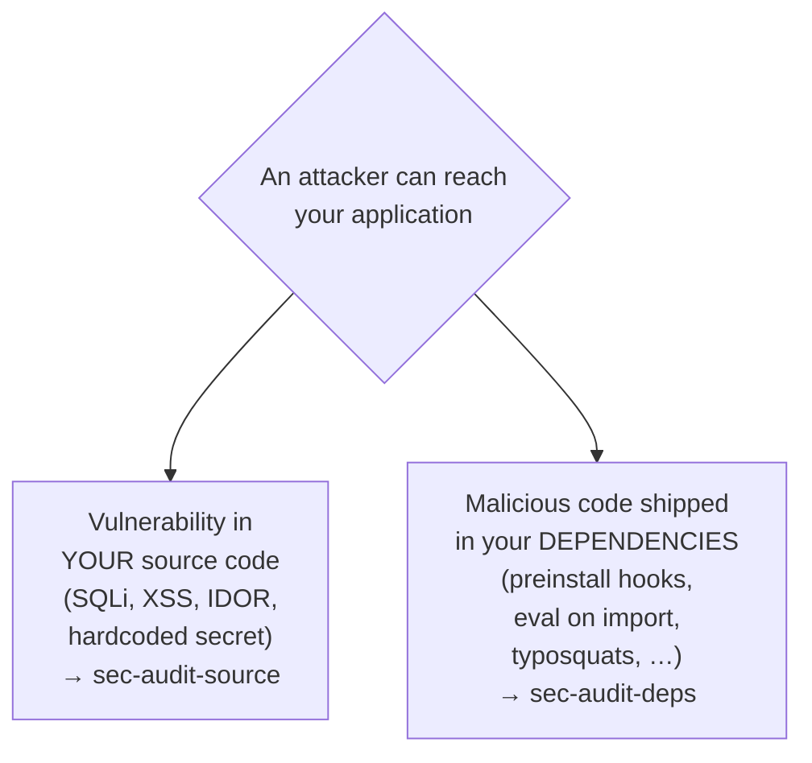
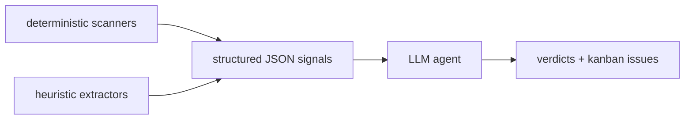

[← Documentation index](README.md)

# Security bots — `sec-audit-source` (Seki) + `sec-audit-deps` (Depsy)

Iterion ships two complementary security audit bundles. They share a
threat-model vocabulary, kanban label conventions, and FP-memory
discipline, but address different layers of the application.

| Bundle | Codename | Role | Inspired by |
|---|---|---|---|
| [`sec-audit-source`](../bots/sec-audit-source/) | Seki | Source-code audit + verified remediation | [vercel-labs/deepsec](https://github.com/vercel-labs/deepsec), [anthropics/defending-code-reference-harness](https://github.com/anthropics/defending-code-reference-harness) |
| [`sec-audit-deps`](../bots/sec-audit-deps/) | Depsy | Installed third-party dependency audit | [SocialGouv/no-package-malware](https://github.com/SocialGouv/no-package-malware) |

## When to run which



Run both as part of pre-release hardening, or pick the one matching
the threat you're chasing.

## Seki — what landed in this branch

Seki was previously an audit-only bot (scanners → triage → single-judge
revalidate → kanban). This branch turns it into an **audit + verified
remediation** bot. Six new capabilities, all in `bots/sec-audit-source/main.bot`:

| # | Capability | Vars (default) | Skill |
|---|---|---|---|
| 1 | **Project security context** — `.iterion/security/context.md` (threat model + auth model + known-FP sources). Loaded or auto-generated on first run; injected into triage + every voter prompt as authoritative scoping (NOT instructions). | `enable_project_context=true`, `context_path=…/security/context.md`, `context_ttl_days=90`, `force_context_refresh=false` | [`project-context.md`](../bots/sec-audit-source/skills/project-context.md), [`threat-model.md`](../bots/sec-audit-source/skills/threat-model.md) |
| 2 | **N-vote adversarial revalidation** — the single judge becomes a **fixed pool of 3 independent cross-family "disprove" voters** (v1/v3 = claw + gpt-5.5, v2 = claude_code + opus-4-8). Majority drives the verdict; `await: best_effort` tolerates one crashed voter. Voters consult `git log`/`git blame` for `fixed_recently` / `introduced_recently` signals. Unanimous dismiss with a cited guard appends to `fp-known.yaml`. | `confirm_threshold=2`, `fp_append_policy="unanimous_dismiss"` | [`disprove-voting.md`](../bots/sec-audit-source/skills/disprove-voting.md) |
| 3 | **Diff/incremental mode** — when set, scopes triage to files changed between the working tree and `git merge-base <diff_base> HEAD` (mirrors `code-review` `diff_precheck` shape). Scanners still walk the whole tree; the narrowing happens at triage via `file_filter`. Empty = full scan. | `diff_base=""` (try `main`, `origin/main`, or `HEAD` for uncommitted-only) | (handled by `diff_scope` tool node) |
| 4 | **Optional deepsec scanner backend** — runs `deepsec init/scan/process/export` headlessly from the workspace; the JSON is ingested by triage like any other scanner. Reuses the local `claude` subscription when no AI Gateway key is set. Requires Node 22 + a deepsec clone. ALWAYS exits 0 — a missing binary degrades gracefully. | `enable_deepsec=false`, `deepsec_concurrency=4`, `deepsec_process_limit=50`, `deepsec_root="${HOME}/lab/ai/references/deepsec"` | [`scanner-deepsec.md`](../bots/sec-audit-source/skills/scanner-deepsec.md), see also [references-bootstrap.md](references-bootstrap.md) |
| 5 | **Integrated remediation phase** — per confirmed finding: `patch_author` → `build_rung` → `reproduce_rung` (original scanner rule no longer fires) → `regress_rung` (tests pass) → `reattack` (fresh judge probes the vuln CLASS across the package) → `reviewer_isolation` (judge sees only `{file, line, category, diff}` — schema-enforced) → `aggregate_verdict`. In apply modes, verified patches commit to a temp branch `iterion/sec-fix/<run-id>`; `apply_gated` PAUSES on a human gate (`iterion resume --run-id <id> --answer approved=true\|false`) before merging `--no-ff` to the user's branch; `apply_auto` skips the gate; `propose` only writes diffs. Crypto + secrets are always hard-stopped. | `remediate=true`, `remediation_mode="apply_gated"`, `hard_stop_categories="crypto,secrets"`, `max_fix_per_run=10`, `patch_attempts=1`, `patch_dir=…/security/patches` | [`security-patcher.md`](security-patcher.md), [`patch.md`](../bots/sec-audit-source/skills/patch.md), [`reattack-oracles.md`](../bots/sec-audit-source/skills/reattack-oracles.md), [`reviewer-isolation.md`](../bots/sec-audit-source/skills/reviewer-isolation.md), [`crypto-handling.md`](../bots/sec-audit-source/skills/crypto-handling.md) |
| 6 | **Env-overridable cost-tier backend** — the whole bot can run on a Claude Code subscription with no API key. Override `ITERION_SEC_AUDIT_BACKEND=claude_code` (default `claw`) and the matching model vars. Voters can mix families (default keeps cross-family signal: v2 on `claude_code` + opus-4-8). | `ITERION_SEC_AUDIT_BACKEND` (`claw`), `ITERION_SEC_AUDIT_MODEL` (`openai/gpt-5.5`), `ITERION_SEC_AUDIT_VOTER_V1_MODEL`, `ITERION_SEC_AUDIT_VOTER_V3_MODEL` (`openai/gpt-5.5`), `ITERION_SEC_AUDIT_VOTER_V2_MODEL` (`claude-opus-4-8`), `ITERION_SEC_PATCH_MODEL` (`claude-opus-4-8`) | (env overrides on `agent`/`judge` declarations in `main.bot`) |

End-to-end on the subscription, no API key, with the default gated remediation:

```bash
ITERION_SEC_AUDIT_BACKEND=claude_code \
ITERION_SEC_AUDIT_MODEL=claude-opus-4-8 \
ITERION_SEC_AUDIT_VOTER_V1_MODEL=claude-opus-4-8 \
ITERION_SEC_AUDIT_VOTER_V3_MODEL=claude-opus-4-8 \
ITERION_REFERENCES_ROOT=$HOME/lab/ai/references \
  devbox run -- iterion run bots/sec-audit-source/main.bot \
  --var workspace_dir=$(pwd) \
  --var enable_deepsec=true \
  --var diff_base=origin/main
# When the workflow pauses on approve_fixes, inspect the temp branch then:
#   iterion resume --run-id <id> --answer approved=true   # merge to your branch
#   iterion resume --run-id <id> --answer approved=false  # abandon; temp branch kept
```

See [`security-patcher.md`](security-patcher.md) for the remediation phase in
depth (ladder rungs, modes, temp-branch + human-gate flow, crypto/secrets
hard-stop) and [`references-bootstrap.md`](references-bootstrap.md) for the
deepsec + harness clone setup and `ITERION_REFERENCES_ROOT`.

The budget headroom was bumped from `$25` to `$70/run` to absorb the 3-voter
pool + the remediation ladder; lower `ITERION_SEC_AUDIT_EFFORT_VOTER` to claw
budget back on small repos.

## Architectural patterns shared by both

### Static signals → LLM with strict JSON schema

Both bots delegate **pattern matching to deterministic tools**
(scanners or heuristic extractors) and use the LLM only for
**normalisation + reasoning + emission**:



Rationale:
- Determinism: scanner output is identical on identical input.
- Coverage attribution: a missed vuln is traceable to a ruleset.
- Cost: scanners are free; LLM tokens are not.

### Two-phase judge for FP reduction

`sec-audit-source.revalidate` runs the deepsec-inspired pass-1
(promote/dismiss/uncertain) followed by pass-2 self-critique that
specifically hunts for façades and over-relied dismissals. See
the `revalidate_system` prompt and
[memory `feedback_judge_two_phase`](../README.md).

### Cross-run memory

Each bot retains state between runs so it doesn't repeat itself:

| Bot | Memory | Location | Visibility |
|---|---|---|---|
| `sec-audit-source` | False positives | `.iterion/security/fp-known.yaml` in the scanned repo | Committed; human-reviewable |
| `sec-audit-deps` | Per-package verdicts | `~/.iterion/security-cache/packages.jsonl` | Host-wide; auto-mounted in sandbox via `host_state: auto` |

The `sec-audit-source` FP memory is per-repo because false positives
are pattern-specific: `urlSafe(input)` may guard an SSRF in repo A
and miss in repo B. The `sec-audit-deps` package cache is host-wide
because a published `name@version+checksum` is universally
identifiable.

### Capability-gated board writes

The node that creates kanban issues declares the minimum capability
set it needs:

```
report_card / llm_review:
  capabilities: [board.read, board.create, board.label]
```

Everything else (`detect_tech`, scanner tools, `triage`,
`revalidate`, …) runs `readonly: true` without board capabilities.
A capability-denied attempt to write the board surfaces as a hard
runtime error.

### Per-language extensibility

Both bots structure their language coverage as **one skill +
one router branch per language**. Adding a language:

1. Add `skills/lang-<id>.md` describing scanners / heuristics for
   the language.
2. Add a `run_<id>_scanners` (or `_heuristics`) tool node in
   `main.bot`.
3. Wire the router with a `when has_<id>` condition.

V1 ships:
- `sec-audit-source`: JS/TS, Go, Python + always-on generic (gitleaks
  + trivy + semgrep auto).
- `sec-audit-deps`: npm/yarn/pnpm, pip/poetry/uv, go modules +
  always-on generic.

Roadmap candidates: PHP, Ruby, Rust, JVM (Maven/Gradle), .NET (NuGet).

## Kanban label conventions

| Label | Emitted by | Purpose |
|---|---|---|
| `severity:<low\|medium\|high\|critical>` | both | Bucketing on the board |
| `type:<finding-type>` | sec-audit-source | One of 12 from `[[finding-taxonomy]]` |
| `type:supply-chain-<signal-id>` | sec-audit-deps | Primary signal that triggered the issue |
| `scanner:<id>` | sec-audit-source | Primary scanner (`semgrep`, `gosec`, `bandit`, `gitleaks`, `trivy`) |
| `ecosystem:<id>` | sec-audit-deps | `npm`, `pypi`, `gomod` |
| `source:sec-audit-source` / `source:sec-audit-deps` | both | Lets a remediation bot filter to security findings |
| `triage-uncertain` | sec-audit-source | Revalidate voters split or all uncertain; human review needed |
| `patched:seki` / `patch-proposed:seki` | sec-audit-source | Remediation phase landed a verified patch (committed/merged) vs only wrote a draft diff |
| `seki-verdict:<verified\|uncertain>` | sec-audit-source | Remediation ladder outcome |
| `seki-fix-pending` / `seki-fix-rejected:<reason>` | sec-audit-source | apply_gated abandoned by operator / ladder rejected the diff |
| `seki-hard-stop:<finding_type>` + `human-review` | sec-audit-source | Crypto / secrets finding routed to human (never auto-patched) |
| `patch-artifact:<path>` / `seki-temp-branch:<branch>` / `seki-merge-sha:<sha>` | sec-audit-source | Audit-trail anchors written by `remediation_report` |

A downstream remediation router can list issues via
`mcp__iterion_board__list_issues` with `labels: ["source:sec-audit-source"]`
to scope itself to security findings, and filter further on
`patched:seki` / `patch-proposed:seki` / `seki-hard-stop:*` to decide
whether human follow-up is still needed.

## Comparison with deepsec

[deepsec](https://github.com/vercel-labs/deepsec) and `sec-audit-source`
target similar problems with different ergonomics. Trade-offs:

| Property | deepsec | `sec-audit-source` (Seki) |
|---|---|---|
| Distribution | Vercel AI Gateway + Vercel Sandbox; npx install | Self-hosted; bundled with iterion |
| Distributed execution | Yes (`--sandboxes N --concurrency M`) | Sharded (`shard_size > 0` dispatches N child runs); cloud queue fan-out via iterion's cloud mode |
| Matcher expressiveness | Programmatic TS plugins (full filtering / multi-pattern / per-file state) | Scanner-based (semgrep / gosec / bandit / gitleaks / trivy) + custom programmatic matchers under `.iterion/security/matchers/` + optional deepsec backend via `--var enable_deepsec=true` (see [references-bootstrap.md](references-bootstrap.md)) |
| Per-file append-only records | Yes (atomic locking, distributed-ready) | `.iterion/security/files/<sha1(path)>.json` — append-only history, scoped to single-process runs + sharded children |
| Project context file | `INFO.md` per project | `.iterion/security/context.md` — auto-generated on first run via the harness-derived [`threat-model`](../bots/sec-audit-source/skills/threat-model.md) skill, committable, TTL-refreshed (`context_ttl_days=90`) |
| Diff / PR mode | `--diff origin/main` | `--var diff_base=origin/main` (merge-base scoped triage) |
| FP reduction | revalidate consults git history | 3-voter "disprove" majority + git-log/blame signal per voter (see [`disprove-voting.md`](../bots/sec-audit-source/skills/disprove-voting.md)) |
| Remediation / patch | none (scan only) | Verification-ladder remediation phase (build → reproduce → regress → reattack → reviewer-isolation), three modes (`propose` / `apply_gated` / `apply_auto`), crypto/secrets hard-stop. See [`security-patcher.md`](security-patcher.md) |
| Operator-visible FP suppression | `revalidate` verdicts in workspace | Committed `.iterion/security/fp-known.yaml` (appended only on unanimous-dismiss + cited guard) |
| Integration with project boards / dispatcher | None built-in | Native: each finding is a kanban issue, then `remediation_report` labels it with the per-finding ladder outcome |
| Budget headroom | Tuned for $1000s/scan large monorepos | `max_cost_usd=70` per run (bumped from 25 to absorb voters + ladder); cloud mode scales further |

## Comparison with no-package-malware

[no-package-malware](https://github.com/SocialGouv/no-package-malware)
solves a different problem: it's a **Verdaccio gateway** that
intercepts npm installs at the registry boundary. `sec-audit-deps`
runs **after** the install, on the installed tree.

| Property | no-package-malware | `sec-audit-deps` |
|---|---|---|
| Position | In front of `npm install` (registry proxy) | Post-install audit |
| Enforcement | Fail-closed: blocks `npm install` of risky versions | Advisory: surfaces issues, doesn't block install |
| Ecosystems | npm only | npm + pip + go modules (extensible) |
| State | MongoDB + Redis + Verdaccio + workers | Bundle-only (one JSONL file) |
| Org / token / budget model | Yes (per-org Verdaccio tokens) | None; runs on whoever invoked `iterion run` |

Use both if you can: the gateway prevents known-bad versions from
ever landing on disk; the audit-bundle catches what slipped through
+ provides a board-integrated remediation surface.

## See also

- [`docs/security-patcher.md`](security-patcher.md) — Seki's verification-ladder
  remediation phase (modes, temp-branch + human-gate flow, crypto/secrets hard-stop)
- [`docs/references-bootstrap.md`](references-bootstrap.md) — clone deepsec +
  the harness into `~/lab/ai/references/`, the `ITERION_REFERENCES_ROOT`
  override, Node 22 requirement, on-demand harness invocation
- [`bots/sec-audit-source/README.md`](../bots/sec-audit-source/README.md)
- [`bots/sec-audit-deps/README.md`](../bots/sec-audit-deps/README.md)
- [`docs/bundles.md`](bundles.md) — bundle layout + runtime resolution
- [`docs/native-tracker.md`](native-tracker.md) — the kanban board
  where findings land
- [`docs/workflow_authoring_pitfalls.md`](workflow_authoring_pitfalls.md) —
  Goodhart's law in workflow design (façade resistance), required
  reading if you author `.bot` files
