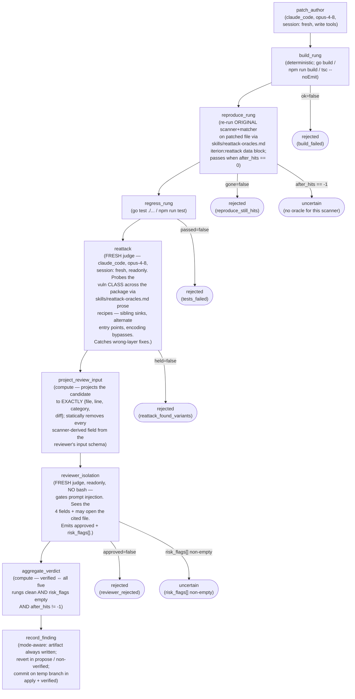
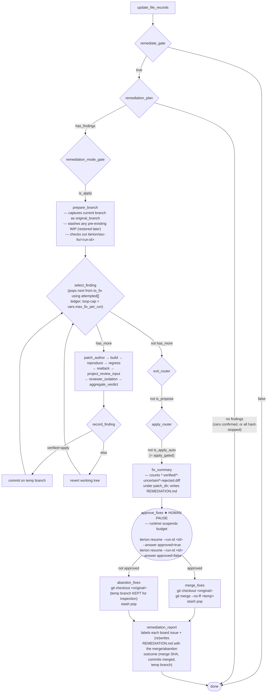

[← Documentation index](README.md) · [← Security bots](security-bots.md)

# Seki — verification-ladder remediation (security-patcher)

Seki's remediation phase turns each confirmed finding into a verified
diff and (optionally) commits it. It is gated by `--var remediate=true`
(default) and chooses one of three modes via `--var remediation_mode`
(default `apply_gated`).

The shape was adapted from Anthropic's
[`defending-code-reference-harness`](https://github.com/anthropics/defending-code-reference-harness)
`/patch` reference (build → reproduce → regress → re-attack → reviewer).
Published evals on the harness pipeline show **~60% of model patches
build + remove the original scanner symptom, but <15% survive the
adversarial re-attack rung** — i.e. the patches that look fine on tier-0
and tier-1 still leave the root cause reachable somewhere else in the
package. Seki's ladder exists to catch that 45% before merging.

The phase is wired downstream of `update_file_records` and runs at most
`--var max_fix_per_run` findings per run (default `10`).
Crypto + secrets findings are filtered out before the loop ever runs
(`--var hard_stop_categories="crypto,secrets"`) and surfaced as
human-review board issues; see [crypto-handling.md](../bots/sec-audit-source/skills/crypto-handling.md).

## The ladder — what each rung proves

For one finding, the loop body is:



| Rung | What it proves | Failure status |
|---|---|---|
| `build_rung` | Patched tree still compiles | `rejected` (`build_failed`) |
| `reproduce_rung` | Original scanner+matcher no longer fires on the patched file | `rejected` (`reproduce_still_hits`) or `uncertain` when no oracle exists for the scanner |
| `regress_rung` | Pre-existing test suite still passes | `rejected` (`tests_failed`) |
| `reattack` | The same vuln CLASS is not reachable elsewhere in the package | `rejected` (`reattack_found_variants`) |
| `reviewer_isolation` | The diff is a defensible fix judged from `{file, line, category, diff}` alone (prompt-injection-resistant) | `rejected` (`reviewer_rejected`) or `uncertain` when any `risk_flags[]` are raised |

Status truth table (after the ladder):

| build | reproduce | regress | reattack | reviewer | risk_flags | oracle? | status |
|---|---|---|---|---|---|---|---|
| ok | gone | passed | held | approved | empty | yes | `verified` |
| ok | gone | passed | held | approved | non-empty | any | `uncertain` |
| ok | gone | passed | held | approved | empty | no oracle (`after_hits == -1`) | `uncertain` |
| any | any | any | any | any | (any) | any | `rejected` on first failing rung |

## Reviewer-isolation contract

The reviewer is the LAST rung and the strongest defence against prompt
injection that rode in through scanner messages, source comments, or
the patch author's own rationale. It sees a **schema-projected**
input — the `project_review_input` compute publishes only
`{file, line, category, diff}` into `review_isolation_input`, and the
reviewer's input schema does not carry any of the upstream
scanner_body / exploit_hypothesis / patch_author.rationale fields.
The isolation is enforced at the schema level, not by prompt
discipline.

The reviewer also runs:

- `tools: [read_file, glob, grep]` — **no `bash`**, so it cannot run
  scanners, cannot read scanner output indirectly, and cannot
  `git log`/`git blame` (which leaks commit messages that carry the
  same injection surface).
- `readonly: true` — no write tools.
- `session: fresh` — zero context bleed from `patch_author`.

It MAY open the cited source file + its immediate neighbours. It MUST
NOT read anything under `.iterion/security/`. Full policy + the
canonical `risk_flags[]` vocabulary (`touches_crypto_primitive`,
`removes_existing_guard`, `widens_attack_surface`,
`touches_iterion_state`, `comment_only`, `regression_test_only`,
`cross_file_drive_by`, `unfamiliar_pattern`) lives in
[`reviewer-isolation.md`](../bots/sec-audit-source/skills/reviewer-isolation.md).

## Crypto + secrets hard-stop

Two finding categories are **never auto-patched**, regardless of mode
or ladder outcome:

- **crypto** — silent-failure-mode bugs (weakened MAC, non-constant-time
  compare, re-used IV, downgraded RNG, hash-then-MAC vs
  encrypt-then-MAC). Scanners catch *patterns*, not protocol
  correctness; the reattack rung has no oracle for constant-time leaks;
  a patch that compiles and re-passes the unit test can be silently
  broken everywhere else.
- **secrets** — rotations are operator-only, not diffs.

Defence-in-depth: `remediation_plan` filters
`vars.hard_stop_categories` (`"crypto,secrets"` by default) into
`hard_stopped[]` before the loop ever runs, AND the `patch_author`
prompt's CRYPTO/SECRETS HARD-STOP clause refuses to author a fix when
the finding's `finding_type` is in the list OR the file path matches
the crypto path patterns in
[`crypto-handling.md`](../bots/sec-audit-source/skills/crypto-handling.md)
(`**/crypto/**`, `**/jwt/**`, `**/keys/**`, `**/x509/**`, …).

The board issue stays open with labels
`seki-hard-stop:<finding_type>` + `human-review`, and
`remediation_report` writes a row in `REMEDIATION.md`'s Hard-stopped
section pointing the operator at the rotation runbook.

## The three modes

`--var remediation_mode` controls how the workflow disposes of verified
fixes once the ladder has cleared them.

| Mode | Verified diff → | Rejected / uncertain → | Pause? | User branch touched? |
|---|---|---|---|---|
| `propose` | Diff artifact under `<patch_dir>/<finding_id>-verified.diff`, working tree reverted | Diff artifact (`*-rejected.diff` / `*-uncertain.diff`), working tree reverted | no | never |
| `apply_gated` (DEFAULT) | Committed on temp branch `iterion/sec-fix/<run-id>` | Reverted (so a rejected attempt does not pollute the temp branch); artifact still written | **YES** on `approve_fixes` after the loop | only if operator answers `approved=true` (`git merge --no-ff`) |
| `apply_auto` | Committed on temp branch AND merged back without a gate | Reverted; artifact written | no | always (after the loop, unless zero verifieds landed) |

In **all three modes** the diff artifact is written to
`<patch_dir>/<finding_id>-<status>.diff` for the audit trail
(`vars.patch_dir = .iterion/security/patches` by default), the kanban
board is labelled per the mode-specific table in
`remediation_report`'s system prompt, and the working tree is restored
to a clean state before the next finding starts.

### When to use which mode

| Mode | Use when | Don't use when |
|---|---|---|
| `propose` | First runs on a new repo, demos, dry-runs, hostile-PR review where you don't want any branch mutation | You expect to apply most of the fixes — you'll re-run with `apply_gated` anyway |
| `apply_gated` | Default for human-in-the-loop dev / PR workflows. Lets you inspect the temp branch + `REMEDIATION.md` before deciding | A trusted CI pipeline that already has a downstream PR review gate |
| `apply_auto` | Trusted CI pipeline with its own downstream review (the merged PR is reviewed elsewhere) | Local dev (the human is right there — let them gate) |

`apply_gated` is the safe default: even if Seki produces a wrong
patch, no fix lands on your branch without your `approved=true`. The
runtime suspends budget on the human pause so a long review wait
costs nothing.

## Temp-branch + human-gate + merge flow (apply_gated)



`apply_auto` shortcuts the `fix_summary` → `approve_fixes` pause and
routes straight from `apply_router` to `merge_fixes`. `propose` skips
`prepare_branch` (no temp branch created), so the `record_finding`
node falls back to its revert-only path even for verified outcomes,
and the `exit_router` lands directly on `remediation_report`.

### Inspection before answering the gate

When the workflow pauses on `approve_fixes`, inspect the temp branch:

```bash
git -C <workspace> diff <original_branch>..iterion/sec-fix/<run-id-suffix>
git -C <workspace> log  <original_branch>..iterion/sec-fix/<run-id-suffix> --oneline
ls .iterion/security/patches/
cat .iterion/security/patches/REMEDIATION.md
```

`REMEDIATION.md` is written by `fix_summary` BEFORE the pause and
embedded into the `approve_fixes_instructions` prompt — so even a
"resume blind" answer has the counts (verified / uncertain / rejected /
hard-stopped), the temp/original branch names, and the resume commands
visible.

### Resume

```bash
# Merge verified commits into the original branch (--no-ff)
iterion resume --run-id <id> --answer approved=true

# Abandon: working tree returns to original_branch, temp branch is KEPT
# for inspection. You can cherry-pick a subset later or `git branch -D`
# the temp branch when done.
iterion resume --run-id <id> --answer approved=false
```

After resume, `remediation_report` re-runs:

- `approved=true`  → merged into original, board labels
  `patched:seki` + `seki-verdict:verified` + `seki-merge-sha:<sha>`.
- `approved=false` → abandoned, board labels `seki-fix-pending` +
  `patch-proposed:seki` + `seki-temp-branch:<branch>`.

A pre-existing dirty working tree is stashed by `prepare_branch`
(`stashed: true`, `stash_ref` recorded) and `git stash pop` is run on
the original branch by either `merge_fixes` or `abandon_fixes` — user
WIP is never silently dropped.

## End-to-end example — Claude Code subscription, no API key

```bash
ITERION_SEC_AUDIT_BACKEND=claude_code \
ITERION_SEC_AUDIT_MODEL=claude-opus-4-8 \
ITERION_SEC_AUDIT_VOTER_V1_MODEL=claude-opus-4-8 \
ITERION_SEC_AUDIT_VOTER_V3_MODEL=claude-opus-4-8 \
ITERION_REFERENCES_ROOT=$HOME/lab/ai/references \
  devbox run -- iterion run bots/sec-audit-source/main.bot \
    --var workspace_dir=$(pwd) \
    --var diff_base=origin/main \
    --var enable_deepsec=true \
    --var remediation_mode=apply_gated \
    --var max_fix_per_run=5

# Workflow runs through scanners, 3-voter triage, then enters
# remediation. On pause:

iterion resume --run-id <id> --answer approved=true
# → merge --no-ff iterion/sec-fix/<run-id> into your current branch
# → REMEDIATION.md updated with the merge sha
# → board issues labelled patched:seki

# Or to keep the temp branch but not merge:
iterion resume --run-id <id> --answer approved=false
# → checkout your original branch, temp branch kept
# → board issues labelled seki-fix-pending
```

A propose-only dry run uses `--var remediation_mode=propose` — every
verified diff lands as a `*-verified.diff` artifact under
`.iterion/security/patches/` and the working tree returns to where it
started after every finding. Useful when you want to read the diffs
before deciding to re-run with `apply_gated`.

## Knobs summary

| Var | Default | Notes |
|---|---|---|
| `remediate` | `true` | `false` → phase fully skipped, identical to pre-remediation behaviour |
| `remediation_mode` | `"apply_gated"` | `propose` \| `apply_gated` \| `apply_auto` |
| `hard_stop_categories` | `"crypto,secrets"` | Comma-separated `finding_type` values that bypass the loop entirely |
| `max_fix_per_run` | `10` | Loop budget — bounds the per-run patch attempts |
| `patch_attempts` | `1` | Inner per-finding retry budget; future nested-retry hook |
| `patch_dir` | `"${PROJECT_DIR}/.iterion/security/patches"` | Diff artifacts + `REMEDIATION.md` land here |
| `ITERION_SEC_PATCH_MODEL` | `claude-opus-4-8` | `patch_author`, `reattack`, `reviewer_isolation`, `remediation_report` model |
| `ITERION_SEC_PATCH_EFFORT_*` | (per node) | `_AUTHOR=high` / `_REATTACK=high` / `_REVIEW=high` / `_REPORT=medium` — lower to claw cost |

## See also

- [`security-bots.md`](security-bots.md) — Seki + Depsy overview, kanban labels, deepsec comparison
- [`references-bootstrap.md`](references-bootstrap.md) — deepsec + harness clones, `ITERION_REFERENCES_ROOT`
- [`skills/patch.md`](../bots/sec-audit-source/skills/patch.md) — the ported `/patch` skill contract
- [`skills/reattack-oracles.md`](../bots/sec-audit-source/skills/reattack-oracles.md) — per-scanner re-run data block + per-category variant-hunt recipes
- [`skills/reviewer-isolation.md`](../bots/sec-audit-source/skills/reviewer-isolation.md) — 4-field projection contract + `risk_flags[]` vocabulary
- [`skills/crypto-handling.md`](../bots/sec-audit-source/skills/crypto-handling.md) — crypto + secrets hard-stop policy
- [`skills/disprove-voting.md`](../bots/sec-audit-source/skills/disprove-voting.md) — the 3-voter triage that produces `confirmed[]`
- [`skills/HARNESS-ATTRIBUTION.md`](../bots/sec-audit-source/skills/HARNESS-ATTRIBUTION.md) — upstream credit for the ported skills
- [`resume.md`](resume.md) — `iterion resume` mechanics
