[← Documentation index](README.md) · [← Iterion](../README.md)

# Visual Editor (web)

Iterion includes a browser-based visual workflow editor built with React and XYFlow. Served by your local `iterion` binary — no installation beyond the CLI.

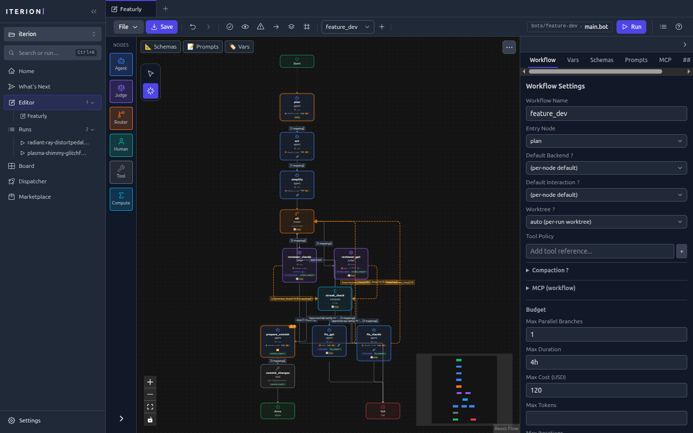

```bash
iterion studio                     # Launch on default port (4891), opens browser
iterion studio --port 8080         # Custom port
iterion studio --dir ./workflows   # Custom working directory
iterion studio --bind 0.0.0.0      # Expose on the LAN (default 127.0.0.1)
iterion studio --bots-path ./bots  # Add a bot discovery path (repeatable; feeds the Launch modal)
iterion studio --no-browser        # Don't auto-open browser
iterion studio --no-browser-pane   # Disable the run console's Browser pane
```

See [cli-reference.md `#iterion-studio`](cli-reference.md#iterion-studio) for the full flag set
(networking, attachments, bot discovery).

## What you get

- **Canvas** — Drag-and-drop node graph with auto-layout, zoom, search, and keyboard shortcuts
- **Node library** — Drag pre-built node types (agent, judge, router, human, tool, compute) onto the canvas
- **Property editor** — Edit node properties, schemas, prompts, and edge conditions in a side panel
- **Source view** — Split-pane view showing the raw workflow source (`.iter` / `.bot`) alongside the visual graph
- **Live diagnostics** — Real-time validation errors and warnings as you edit (codes C001–C086, sparse)
- **File watching** — Detects external file changes via WebSocket and syncs automatically
- **Undo/redo** — Full edit history
- **Launch modal** — Fills `vars` and attachments at launch time, with bot/argument discovery driven by `--bots-path` (the modal's bot picker and argument form consume the same catalogue `iterion bots list` emits)
- **Kanban `/board` view** — Native tracker CRUD with drag-and-drop (gated on `server_info.native_tracker_enabled`; see [native-tracker.md](native-tracker.md))
- **`/dispatcher` dashboard** — Live running + retry tables when `iterion dispatch` is wired (gated on `server_info.dispatcher_enabled`; see [dispatcher.md](dispatcher.md))
- **Browser pane** — Preview URLs, live CDP screencast, and time-travel screenshots tied to a run (see [browser-pane.md](browser-pane.md)). Disable with `--no-browser-pane`.
- **Run console** — Launch a workflow from the studio and watch events stream live

This mode is the simplest way to design and iterate locally. If you want a packaged native window instead (no browser, OS-keychain credentials, auto-update), see the [Desktop App](desktop.md).

## Screenshots

> All shots use the studio's dark theme; a light theme is available from Settings → Appearance or `⌘/Ctrl+K → Cycle theme`.

### Authoring

**Source view** — the raw `.bot` source mirrored beside the graph, edits in either stay in sync.

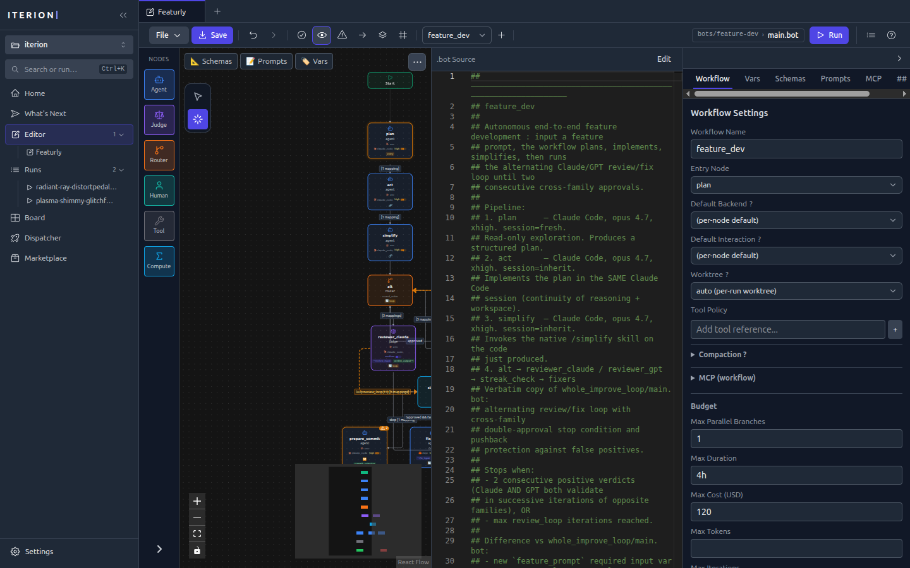

**Launch modal** — fills `vars` and attachments, picks a backend, and previews the estimated cost before the run starts.

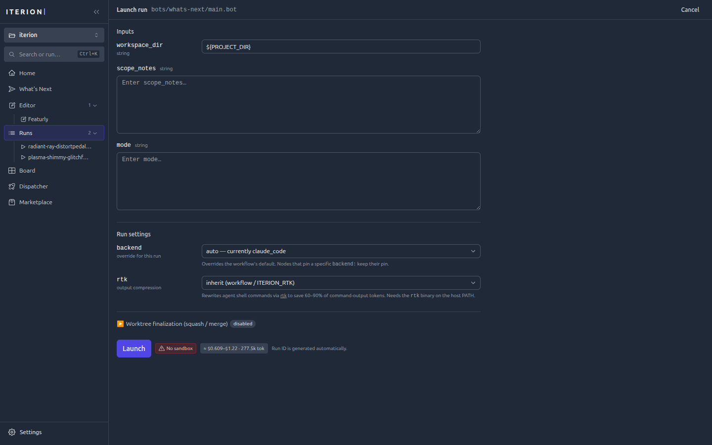

### Running & observing

**Run console** — a live graph of the run, a streaming event log, and a header showing the commit/branch the run landed on.

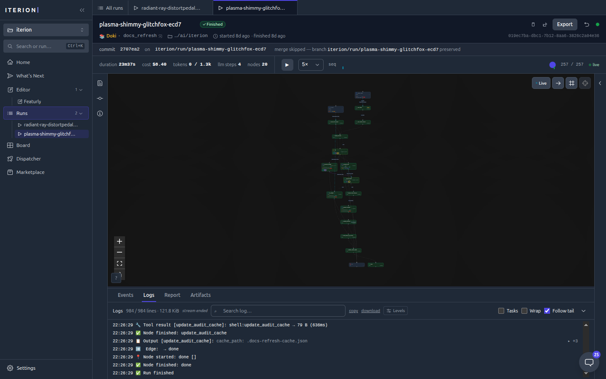

**Cost report** — per-provider and per-model cost attribution for a finished run.

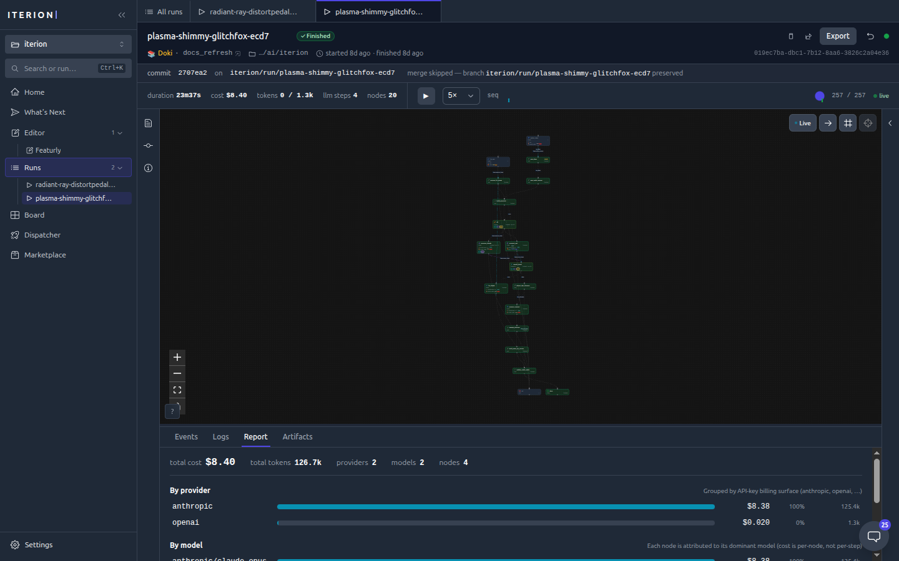

**Runs list** — every run with status, cost, and duration, filterable and sortable.

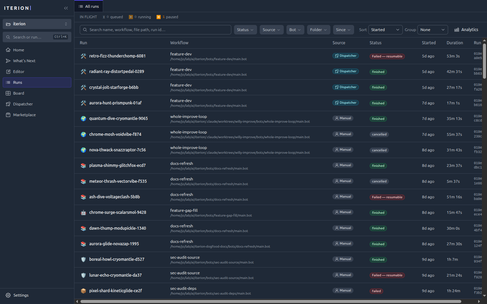

**Run analytics** (`/insights`) — cost over time stacked by workflow, plus per-workflow run counts, fail rates, and P50/P95 durations.

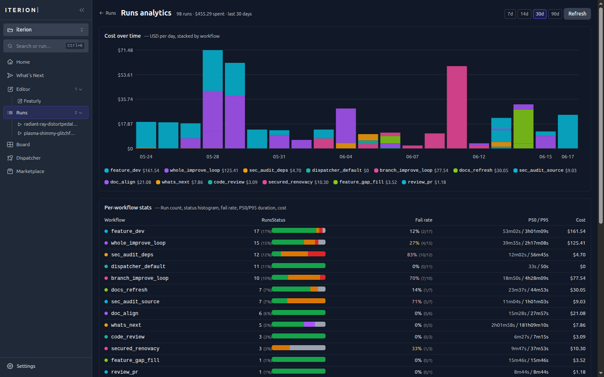

### Orchestration

**Kanban board** (`/board`) — the native tracker with drag-and-drop, labels, and per-card bot assignees.

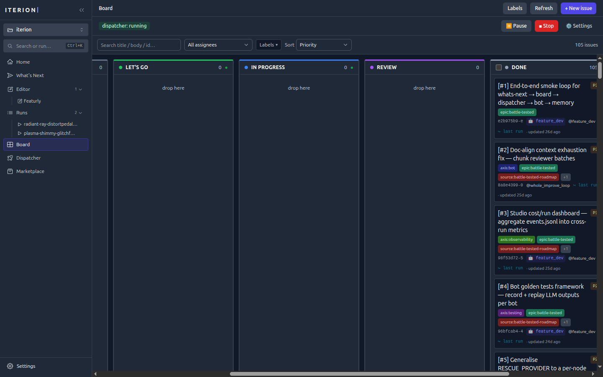

**Dispatcher dashboard** (`/dispatcher`) — live config, in-flight runs, and the retry queue.

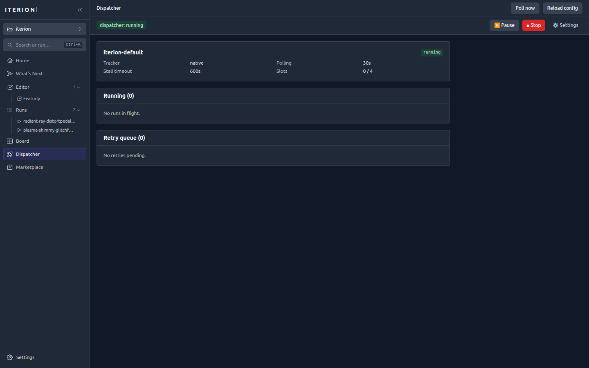

**What's Next** — a conversational session that surveys the repo, proposes a roadmap, and watches the board it dispatches.

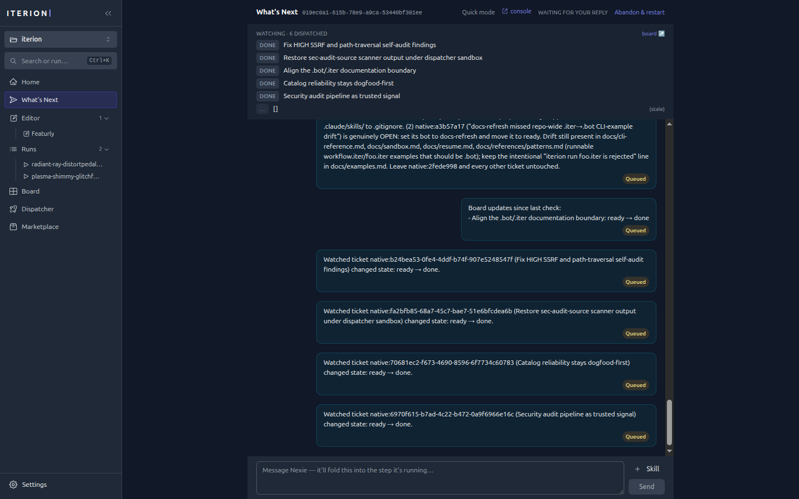

### Workspace & configuration

**Home** — the start page: a What's Next entry, the bot catalog, and recent runs.

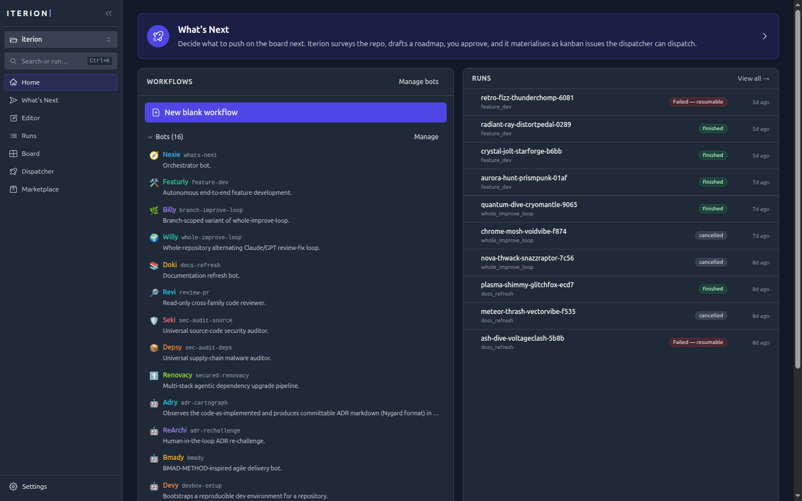

**Command palette** (`⌘/Ctrl+K`) — jump to any view, run, or action; cycle the theme.

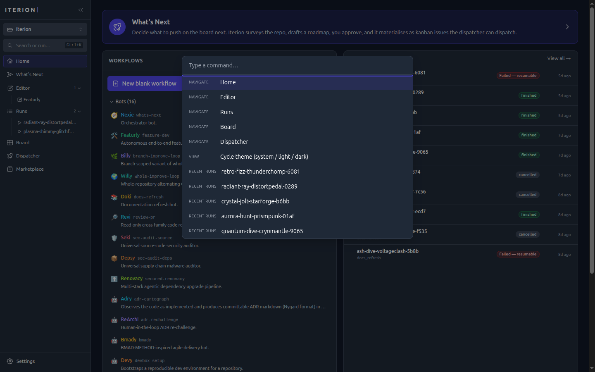

**Bot catalog** — enable/disable bots and import new ones from a repository.

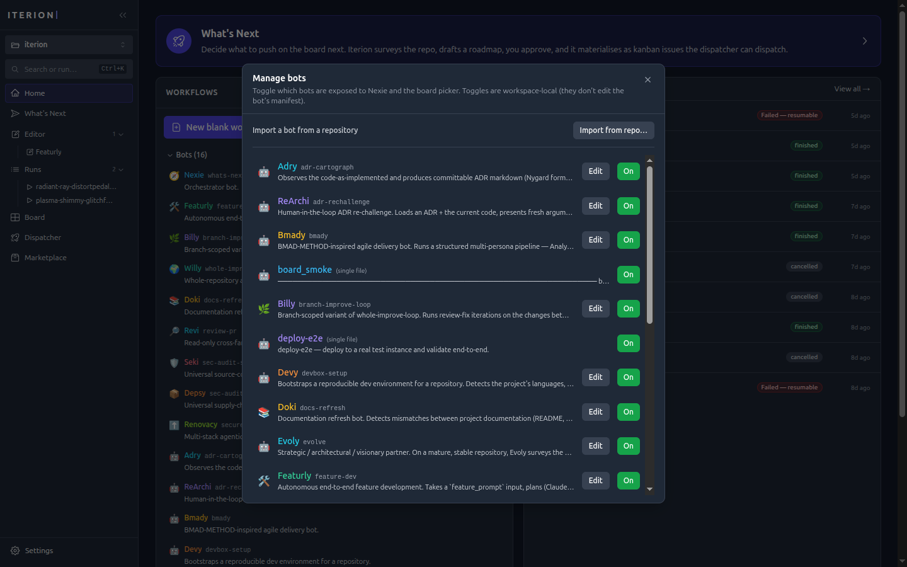

**Backends** (Settings → Backends) — auto-detected LLM credentials and the resolved default backend.

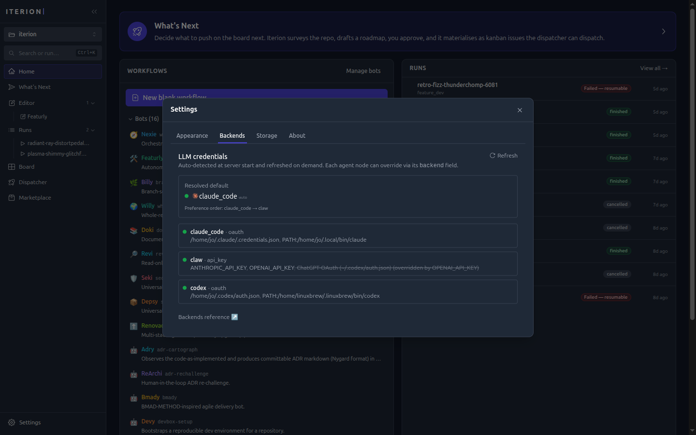

**Appearance** (Settings → Appearance) — theme (System / Light / Dark) and chat-input behaviour.

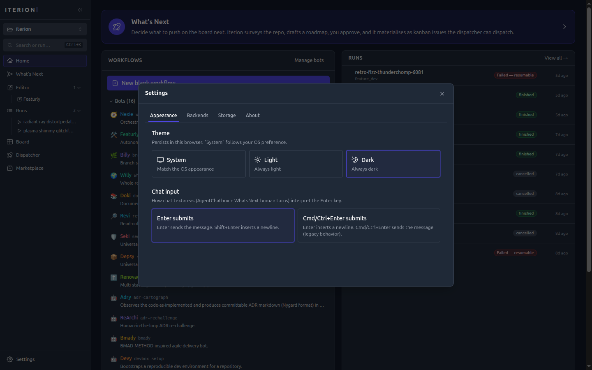

**Marketplace** — browse, submit, and install published `.botz` bundles.

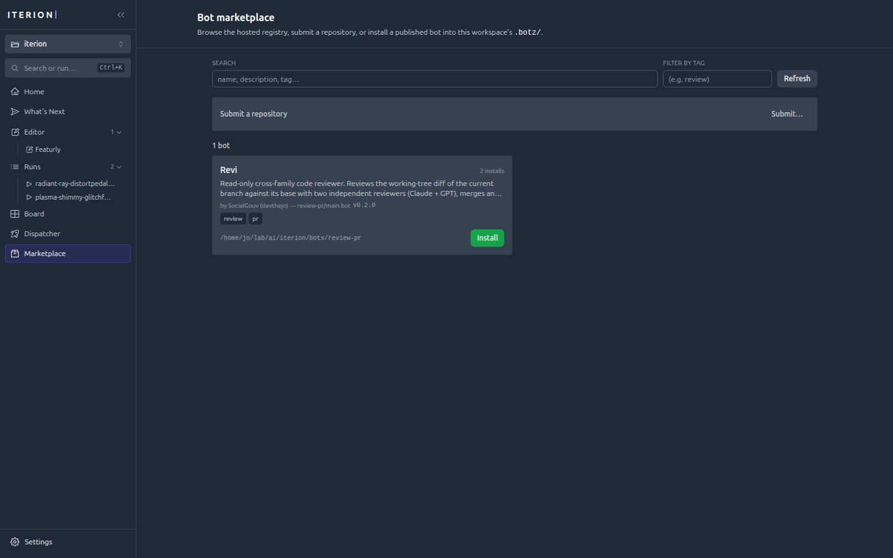
